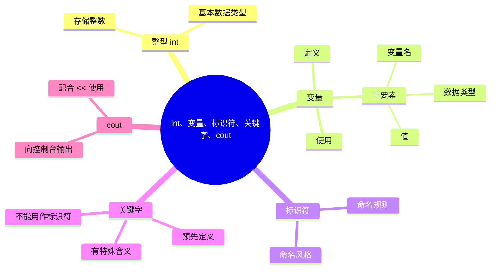

# int，变量，标识符，关键字，cout

> [!tip] **提示**：学习引导
> 想象你有一些盒子，你可以往里面放置物品，每个盒子上都贴有标签来给物品分类，标签上写有物品的名称和大小信息。
> 
> 在C++中，变量就是盒子，你可以在其中放置或取出数据，每个变量都具有**类型**，决定了它能放什么样的数据（整数，小数等），以及最大能放多大的数据。变量具有一个名称，可以通过这个名称来取出这个变量存储的数据或放入新的数据。
---

## 1. 整型 int

整型是一种**基本数据类型**，简单来说，它就是数学中的整数，最常用的整型是 `int`。

| 项目         | 内容                                                           |
| ---------- | ------------------------------------------------------------ |
| 类型名        | `int`                                                        |
| 类别         | 整型（整数类型）                                                     |
| 作用         | 存储整数                                                         |
| 常见内存大小     | 通常 4 字节（32 位）                                                |
| 常见取值范围     | $-2,147,483,648$ ~ $2,147,483,647$（$-2^{31}$ ~ $2^{31} - 1$） |
| 是否有符号（即正负） | 默认有符号（`signed int`）                                          |

比如说，`int` 类型的变量的值可以是 `0`, `-12345`, `325`, `+1`，但不能是 `3.14`（这是小数），`2,147,483,648`（超过 `int` 的取值范围）。

> [!TIP] **提示**：学习建议
> 由于目前是入门阶段，这里不会深入地讲解整型，如果你想更深入地了解整型，请阅览 [[占位]]。 #issue

---

## 2. 变量和标识符 Variable & Identifier

### 2.1 变量的基本概念

**变量（Variable）** 用于存储数据。变量有三个核心要素：

| 要素       | 说明                           | 示例                      |
| -------- | ---------------------------- | ----------------------- |
| **变量名**  | 变量的名字，用于在程序中标识和访问这个变量。       | `age`、`score`、`name`    |
| **数据类型** | 规定变量能存储哪种数据、占多少内存、能进行哪些运算    | `int`、`double`、`string` |
| **值**    | 变量实际存储的数据内容，可以在程序运行过程中被读取或修改 | `25`、`3.14`、`"Hello"`   |

变量存储在计算机的内存中。

> [!info] **概念**：内存和外存
> 日常生活中，我们经常把内存和外存混为一谈，这里做一个说明和区分：
> 
> **内存（Memory）** 是计算机中用于**临时存储**数据的硬件，例如内存条，程序运行时用到的变量、对象等通常都存放在内存中。内存的读写速度快，但断电后数据会丢失。
>
> **外存（External Storage）** 是用于**长期存储**数据的部件，例如硬盘、U 盘等。外存容量大、断电后数据仍能保留，但读写速度通常比内存慢。
>
> 可以简单理解为：
> - **内存**：程序运行时的“工作台”，变量就放在这里。
> - **外存**：程序和数据长期存放的“仓库”，比如你写的 `.cpp` 文件、编译出的可执行文件（如 `.exe`），都保存在外存里。
>
> 程序运行时，通常会把需要处理的数据从外存加载到内存，再由 CPU 读取内存中的数据进行运算。

![[内存中的变量.jpg]]

### 2.2 变量的创建

要使用变量，我们首先需要“创建”变量，这里的“创建”就是变量的**定义（definition）**。定义可以让编译器知道这个变量的存在，从而正常识别代码，否则编译器会认为你不小心写了个错误的语句。

**定义变量的语法**：

```cpp
数据类型 标识符 [= 初始值];
```

- `标识符` 是我们自己为变量起的名字，即**变量名**。
- `[...]`，表示 `[]` 内的内容可选，即你可以写 `[= 初始值]`，也可以不写 `[= 初始值]`。

例如：

```cpp
#include <iostream>
using namespace std;

int main()
{
	int variable1;
	int variable2 = 0;
	
	return 0;
}
```

> [!WARNING] **注意**：脏数据
> 我们首先需要了解的是，内存其实会被被划分为很多个“存储单元”，每个“存储单元”都能存储数据，这就像往一个货箱（内存）里放了很多个盒子（“存储单元”）一样。
> 
> 定义变量后，会为该变量在内存中安排一块“存储单元”来存储它，但这块“存储单元”中可能会有之前使用这块内存被使用时残留的数据（被称为**脏数据**），单纯的定义变量并不会自动清除它们，如图：
> 
> ![[定义时的随机值.png]]
> 
> 如果变量 `variable` 被安排存放在存储单元 2 上，那么 `variable` 当前的值就是这些残留的数据。此时如果读取 `variable`的值，程序会按 `int` 的规则去解释这块内存上的数据，得到的值是不确定的，可能是一个无意义的整数。这可能导致程序的运行结果不符预期、崩溃等问题。
> 
> 在C++26版本之前，读取未初始化的变量的值是**未定义行为**；在C++26之后，这是**错误行为**。基本上你不应该这么做。
> 
> 良好的习惯是**定义时就初始化**（即写 `= 初始值`），这样会使用设定的初始值覆盖可能存在的残留数据，防止意外使用这些不确定的值。

> [!info] **概念**：未定义行为 Undefined Behavior，简称 UB
>
>**未定义行为**是指 C++ 标准**没有规定**程序应该如何处理的情况。发生 UB 时，编译器**不做任何保证**，程序可能：
>
>- 看起来“正常工作”
>- 崩溃（段错误）
>- 输出错误结果
>- 行为随机（每次运行不同）
>- 出现安全漏洞
>
>未定义行为是 C++ 中**很危险**的错误。也是常见的运行时错误来源，难以调试（debug），应通过防御性编程等手段极力避免 UB。定义时初始化就是种防御性编程手段。

> [!info] **概念**：声明和定义 Declaration & Definition  
>**声明**告诉编译器“有这么个东西”；**定义**不仅告诉编译器“有这么个东西”，还会为它分配内存。
>
>因此：
>
>- **定义一定也是声明**；
>- **声明不一定是定义**；
>- 两者的关键区别是：**是否分配内存**。
>
>按这个标准，可以分成两类：
>
>- **定义**：会分配内存，例如 `int var;`、`int var = 1;`；
>- **非定义的声明**：不分配内存，例如 `extern int var;`。
>
>注意：日常中常有人说“`int var;` 是声明，`int var = 0;` 是定义”，这种说法并不准确。按 C++ 标准，`int var;` 也是定义，只是没有显式初始化。
>
> 现在我们还不需要了解 `extern` 关键字，如果你想了解 `extern`，可以阅览 [[16. 构建过程、链接属性、extern、inline#3. extern 说明符|16-3. extern 说明符]]。
> 
> （可参考 [定义和 ODR (One Definition Rule) - cppreference.cn - C++参考手册](https://cppreference.cn/w/cpp/language/definition)）
> （可参考 [CPP/语言/定义：修订版之间的差异——cppreference.com](https://en.cppreference.com/mwiki/index.php?title=cpp/language/definition&diff=next&oldid=89123&printable=yes)）

### 2.3 变量的使用

创建变量后，我们就可以使用变量了。通过写出变量名来使用它，例如：

```cpp
#include <iostream>
using namespace std;

int main()
{
	int variable = 0;
	cout << variable;
	
	return 0;
}
```

以上代码中的

```cpp
cout << variable;
```

这一行就是在使用变量，我们读取了 `variable` 的存储的数据 `0` 并把它交给给了 `cout`，让 `cout` 在控制台里输出 “0”。

关于 `cout` 的更多细节，我们将在 [[#4. cout]] 学到。

### 2.4 标识符的命名规则

变量的名字——标识符，并不能随便取，我们需要遵循以下命名规则：

1. 组成标识符的字符应该是英文字母、数字、下划线 `_`，比如 `a`, `Z`, `_4`。
2. 区分大小写，比如 `abc` 和 `abC` 是两个完全不同的标识符。
3. 不能以数字开头，比如 `1person` 不能作为标识符。
4. 不能是关键字（关键字我们会在 [[#3. 关键字]] 讲到），比如 `int` 就是关键字，那么标识符就不能是 `int`，但是可以是 `int_`（也就是包含关键字作为一部分）。
5. 同一个作用域内不能重复定义同名标识符。

**关于第 1 点**：

实际上你可能可以在C++中使用一些非ASCII字符（比如汉字）作为标识符的名称，但出于可移植性考虑，不建议这么做。

**关于第 3 点**：

标识符名称不应以下划线 `_` 开头，。C++ 标准规定在全局空间中保留所有单下划线开头的名称，在任何位置保留双下划线开头的名称，这意味着未来的语言版本中这些名称可能会被语言自身占用。虽然即使你的标识符名称属于被保留的范围大多数时候也不会导致问题，但出于严谨，不建议这么做。

**关于第 5 点**：

这里涉及了“作用域”这个概念，作用域将会在 [[6. 分支、逻辑、关系运算符、作用域#5. 作用域 Scope|6-5. 作用域]] 学习到，这里你可以先理解为你不能在你的代码里定义已存在的标识符。

> [!info] **概念**：命名风格  
>**命名风格**是指给标识符（变量、函数、类等）命名时遵循的一套书写习惯，比如单词大小写、单词之间怎么连接等。
>
>命名风格**不是语法规则**，不影响程序能否编译，只影响代码的可读性和一致性。你可以把变量命名为 `a`、`b`、`c`，程序照样能跑，但别人（包括未来的你）会很难看懂。
>
>常见的命名风格有：
>
>- 蛇形命名法：`person_name`
>    
>- 小驼峰：`personName`
>    
>- 大驼峰：`PersonName`
>    
>- 全大写 + 下划线：`MAX_SIZE`

> [!tip] **提示**：普通变量的命名风格
> 标识符除了要符合命名规则（合法），还应该**语义化**、**可读化**（看得懂、方便读），这就需要良好的命名风格。
> 
>本教程主线部分**参考**谷歌 C++ 风格指南，普通变量采用**蛇形命名法**（snake_case），具体要求如下：
>
>1. **所有单词小写。**
>    
>2. **单词之间用下划线 `_` 连接。**
>    
>
> 例如：`person_name`、`score`、`player2_hp`、`fps`。
>
>现在我们先统一用 snake_case 命名变量；等后面学到常量、数据成员等不同种类的变量时，再介绍它们各自的命名习惯。

---

## 3. 关键字 Keyword

**关键字**（Keyword）是 C++ 语言中**预先保留**的、具有**特殊含义**的单词。它们构成了 C++ 语法的基础，**不能**被用作变量名、函数名、类名等普通标识符。

例如我们之前接触到的 `using` `namespace` `return`, `int` 就是关键字。

C++ 的关键字概览：

![[关键字概览]]

这些关键字你不需要刻意去记，以后我们学习了这些关键字后你自然就会知道有哪些关键字。

---

## 4. cout 的基础用法

`cout` 是 C++ 中用于**向控制台输出**的“工具”，通常配合 `<<` 使用。

因为 `cout` 是包含在 `<iostream>` 内的，所以要使用 `cout`，你应该先写 `#include <iostream>`。这也意味着，如果你不用 `<iostream>` 内的东西，你可以不写 `#include <iostream>`，比如：

```cpp
using namespace std;

int main()
{
	int my_age = 20;
	return 0;
}
```

`cout` 后通常会跟一些 `<<`，`<<` 在这里叫作**流插入运算符**，你可以在流插入运算符后写以下内容：

1. `"..."`，表示输出双引号 `""` 内的内容（即字符串），比如 `"cout << 我的年龄是"`。
2. `变量名` 或 `表达式`，表示输出变量 / 表达式的值，比如 `cout << my_age`。
3. `endl`，表示输出换行，比如 `cout << endl`。

例如：

```cpp
int my_age = 20;
cout << "你今年多大？" << endl;
cout << "我的年龄是 " << my_age << " 岁。";
```

输出：

```text
你今年多大？
我的年龄是 20 岁。
```

你应该能注意到，当 `cout` 后有多个流插入运算符时，这些流插入运算符后的多个内容从左往右依次输出。

> [!WARNING] **注意**：`cout` 支持的数据类型
> （如果你看不懂以下内容，可以仅作了解，留个印象即可）
> `cout` 并非能输出所有数据类型的变量，它能输出的数据类型包括：
> 
> - 所有基本数据类型（`int`, `bool`, `char`, `double` 等）
> - 部分复合数据类型（`string`, 指针 等）
>   
> 本质上，这些数据类型之所以能被 `cout` 输出，是因为其有对应的 `<<` 运算符重载。关于运算符重载，请阅览 [[14. 析构、拷贝构造、RAII、转换构造、this、运算符重载#6. 运算符重载 Operator Overloading|14-6. 运算符重载]]。
> 
> 注意：C++20 起，`char16_t`、`char32_t` 不再支持直接用 `cout <<` 输出。

---



