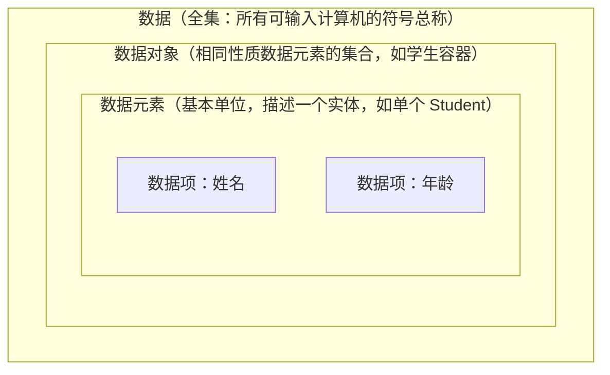
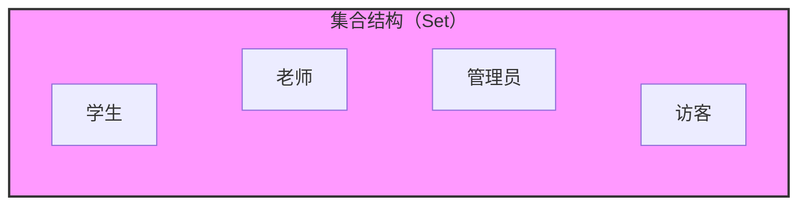
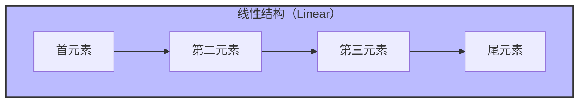
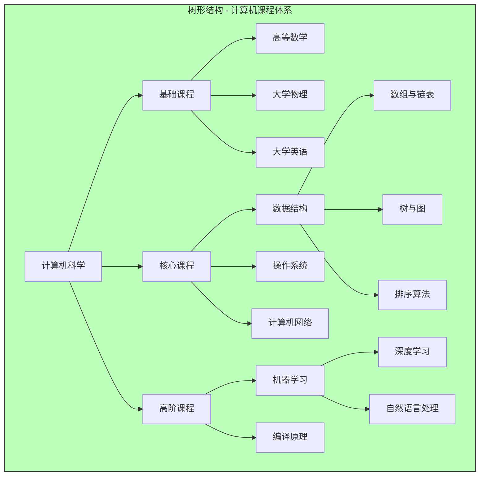
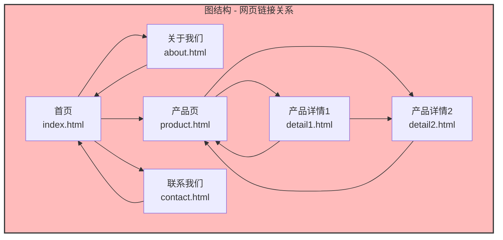
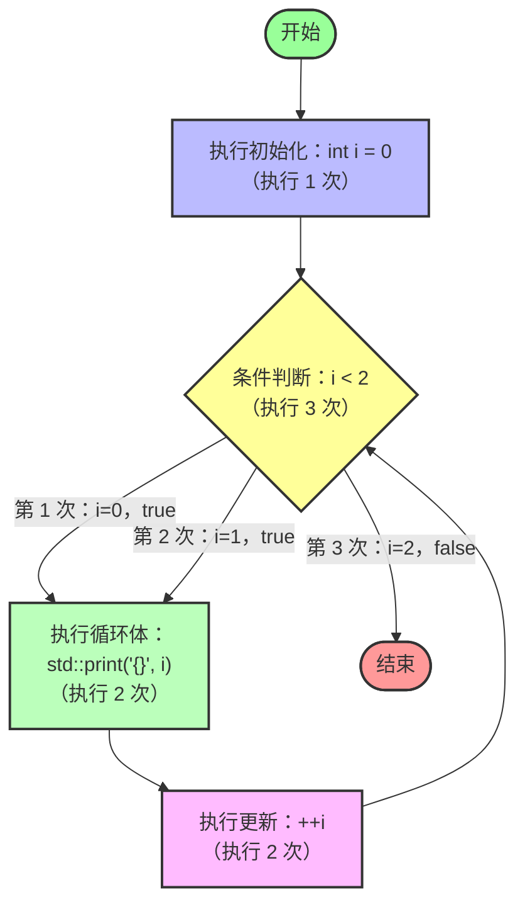

---
tags:
  - 分支
  - 知识类型/数据结构与算法
  - 受审状态/请求
前置知识-最低:
  - C++面向对象
  - 高中数学
前置知识-推荐:
  - std::print
  - 高等数学
updated: 2026-09-11
---
# 数据结构与算法的基础概念

## 1. 数据

**数据元素（Data Element）** 是数据的基本单位，它通常可以**完整地**描述一个客观实体或抽象概念，并且可以支持一些操作。比如：学生  `Student`，矩形 `Rect`，颜色 `Color`。

**数据项（Data Item）** 是组成数据元素的**有意义的最小单元**，比如学生的名字，矩形的顶点数，颜色的 rgb 值。

**数据对象（Data Object）** 是具**有相同性质**的数据元素的集合，是数据的一个子集。比如容器中的学生对象 `std::vector<Student>`，容器中的图形 `Shape arr[] = {...}`。

**数据（Data）** 是所有客观事物的符号表示，或者说，数据是所有可输入计算机的符号的总称，它的大小范围很灵活：可以是世界上的几乎所有东西，也可以是一个源文件中的一个数据元素、对象。
但是在数据结构中，我们通常只关心那些**被组织起来**以便高效处理的数据，而不是散落无序的数据。


---

## 2. 数据结构 Data Struct

**数据结构（Data Struct）** 是相互之间存在一种或多种特定关系的数据元素的集合，“结构”指的就是数据之间的关系。

数据结构分为**逻辑结构**和**存储结构（物理结构）**。

### 2.1 逻辑结构 Logical Structure

逻辑结构描述的是数据在逻辑上的关系，它一般是和数学有关的，而非和计算机有关，逻辑结构的分类如下

1. **集合结构 Collection Structure / Set Structure



2. **线性结构 Linear Structure**


^LinearStructure

3. **树结构 Tree Structure**



4. **图结构（网状结构）Graph Structure (Network Structure)**



### 2.2 存储结构

**存储结构**（**Storage Structure**，也称**物理结构** **Physical Structure**）描述的是数据元素在计算机内如何存储，其分类为：

1. 顺序存储结构借元素在存储器中的相对位置来表示逻辑关系，比如：

|  内存地址  | 学生  |
| :----: | :-: |
| 0x0000 | 张三  |
| 0x0010 | 李四  |
| 0x0020 | 王五  |
| 0x0030 | 赵六  |

2. 链式存储结构中每个元素的位置是不连续的，它们通过指针表示关系，比如：

|  内存地址  | 学生  |   下一个元素   |
| :----: | :-: | :-------: |
| 0x0000 | 张三  |  0x0030   |
| 0x0010 |     |           |
| 0x0020 |     |           |
| 0x0030 | 李四  |  0x0090   |
| 0x0040 |     |           |
| 0x0050 |     |           |
| 0x0060 |     |           |
| 0x0070 | 赵六  | `nullptr` |
| 0x0080 |     |           |
| 0x0090 | 王五  |  0x0070   |

---

## 3. 抽象数据类型 

**抽象数据类型（Abstract Data Type, ADT）** 一般指用户定义的、表示应用问题的数学模型以及定义在这个模型上的一组操作的总称，具体包括三部分：

1. 数据对象。
2. 数据对象上关系的集合。
3. 对数据对象的操作的集合。

ADT 的定义格式：

```
ADT 抽象数据类型名 {
	数据对象：<数据对象的定义>
	数据关系：<数据关系的定义>
	基本操作：<基本操作的定义>
} ADT 抽象数据类型名
```

基本操作的定义格式：

```
基本操作名(参数列表)
	初始条件：<初始条件描述>
	操作结果：<操作结果描述>
```

> [!TIP] **提示**：学习建议
> 可能你会觉得这一章节的内容有点抽象，看不懂。但是也没关系，后面会出现 ADT 的具体例子，到那时你就懂了。

> [!TIP] **提示**：关于本系列课程
> 本系列课程在展示 ADT 时，会使用形似 C 的伪码表示。
> 本系列课程在实现一个数据结构时，会**同时**展示 C 代码和 C++ 代码。其中：
> 
> -  C 代码段版本倾向于“**教科书**”和“**应试**”风格。
> - C++ 代码版本倾向于“**工程**”和“**STL**”风格（虽然没有实现 STL 接口，但在命名风格上接近 STL）。

---

## 4. 算法

**算法（Algorithm）** 是为了解决某类问题而规定的一个有限长的操作序列。

### 4.1 算法五个特性

| 特性         | 核心定义                                 |
| ---------- | ------------------------------------ |
| **1. 有穷性** | 算法必须在**有限步骤**内终止，且每一步在**有限时间**内完成    |
| **2. 确定性** | 算法的每一步必须有**明确无歧义**的定义；相同输入产生**相同输出** |
| **3. 可行性** | 每一步都必须是**基本可执行**的操作，能用计算机实现          |
| **4. 输入**  | 算法可以有**零个或多个**输入                     |
| **5. 输出**  | 算法必须有**一个或多个**输出                     |

#### 一、有穷性（Finiteness）

- 算法必须在**执行有限个步骤**之后终止
- 每一步都必须在**有限的时间内**完成
- **通俗理解**：算法不能是"死循环"，必须能停下来
- **关键点**：理论上有限即可，不关心实际运行快慢

**正确示例**：

- `for (i=0; i<100; i++) { sum += i; }` → 循环 100 次后结束

**错误示例**：

- `while (true) { std::print("死循环"); }` → 永远不会停止

#### 二、 确定性（Definiteness）

- 算法的**每一步**都必须有**明确的定义**，不能有歧义
- 对于**相同的输入**，必须产生**相同的输出**
- **通俗理解**：算法是一本"操作手册"，任何人照着做，结果都一样
- **关键点**：不能有模糊条件或随机性

**正确示例**：

- `如果 x > 0，则输出"正数"；否则输出"非正数"` → 条件清晰，结果唯一

**错误示例**：

- `如果天气好，则执行...` → "天气好"定义模糊，不同人理解不同

#### 三、可行性（Effectiveness）

- 算法的每一步操作都必须是**基本可执行的**
- 可以用计算机能执行的**基本操作**来实现
- **通俗理解**：计算机能"听懂"并执行的指令
- **关键点**：不能出现无法实现的操作

**正确示例**：

- `a = b + c` → 加法是基本运算，计算机可以直接执行

**错误示例**：

- `计算所有质数的平均值` → 质数有无穷多个，无法执行

#### 四、输入（Input）

- 一个算法可以有**零个或多个**输入
- **关键点**：输入可以为 0

**有输入示例**：

- `sort(arr, n)` → 排序算法需要传入数组

**零输入示例**：

- `std::print("Hello World")` → 输出固定字符串，不需要输入

#### 五、输出（Output）

- 一个算法必须有**一个或多个**输出
- **关键点**：输出不能为 0，输出是算法存在的意义

**正确示例**：

- `return sum;` → 返回计算结果

**错误示例**：

- `void func() { int a = 1; }` → 只有内部操作，无输出

### 4.2 评价算法优劣的基本标准

| 评价标准    | 说明            | 具体体现                          |
| ------- | ------------- | ----------------------------- |
| **正确性** | 算法能正确解决给定问题   | 输入合法数据，输出正确结果                 |
| **可读性** | 算法易于人理解和维护    | 变量命名清晰、逻辑分层明确、注释完整            |
| **健壮性** | 算法能处理非法输入，不崩溃 | 输入空数组、负数时给出错误提示，而不是崩溃         |
| **高效率** | 时间效率高（运行快）    | 时间复杂度低（如 O(n log n) vs O(n²)） |

### 4.3 算法的时间复杂度计算

衡量算法效率的方法主要有两种：**事后统计法**和**事前分析估算法**。事后统计法受计算机的硬件影响并不准确，所以我们主要采用事前分析估算法。

#### 4.3.1 问题规模和语句频度

我们先要了解两个概念：

**问题规模**：算法求解问题的输入量，一般用 n 表示。

**语句频度（Frequency Count）**：一条语句反复执行的次数。

对于算法：

```cpp
for (int i = 0; i < 2; ++i) { // 频度：3
	std::print("{}", i);      // 频度：2
}
```



也就是说，对于 `for` 循环，我们通常用其判断次数表示它的频度。

现在我们把条件表达式里的 2 替换为问题规模 n，算法：

```cpp
for (int i = 0; i < n; ++i) { // 频度：n + 1
	std::print("{}", i);      // 频度：n
}
```

我们用 $f(n)$ 来表示这个算法的语句频度之和：
$$
f(n) = n + 1 + n = 2n + 1
$$
再来计算这个算法的 $f(n)$：

```cpp
int count = 0;                    // 频度：1
for (int i = 0; i < n; i++) {	  // 频度：n + 1
	for (int j = 0; j < i; j++) { // 频度：(n^2+n)/2
		count++;                  // 频度：(n^2-n)/2
	}
}
```

你可能不太明白第二层 `for` 循环和 `count++` 的频度怎么算，下面我们列个表观察规律：

| `i` | 第二层 `for` 循环的执行次数 | `count++` 的执行次数 |
| :-: | :---------------: | :-------------: |
|  0  |         1         |        0        |
|  1  |         2         |        1        |
|  2  |         3         |        2        |
| ... |        ...        |       ...       |
| n-1 |         n         |       n-1       |
|  n  |         -         |                 |

上表为 `i` 等于各值（即第一层 `for` 循环每执行一次）时，第二层 `for` 循环和 `count++` 在本次的执行次数。

由表中的规律得：第二层 `for` 循环的总执行次数为 $1 + 2 + 3 + \dots + n$，我们观察到这是等差数列，于是对等差数列求和：
$$
\frac{(首项+末项)项数}{2} = \frac{(1 + n)n}{2} = \frac{1}{2}n^2+\frac{1}{2}n
$$
同理，对 `count++` 的总执行次数 $1 + 2 + \dots + n-1$ 求和：
$$
\frac{(1+n-1)(n-1)}{2} = \frac{n^2-n}{2}=\frac{1}{2}n^2-\frac{1}{2}n
$$
于是：
$$
f(n)=1+n+1+\frac{1}{2}n^2+\frac{1}{2}n+\frac{1}{2}n^2-\frac{1}{2}n = n^2+n+2
$$
你能发现，这个算法和我们平时工程实践中写的代码相比算是非常简单的，但是计算过程和计算结果就已经比较复杂了，如果算法再复杂些，计算的复杂性更是让人难以接受，因此，我们需要简化计算。

#### 4.3.2 趋势

通常来说，算法的执行时长是随问题规模增长的，所以对算法的评价一般考虑的是时长随问题规模增长的趋势，比如下图中的趋势：

![[算法规模增长趋势对比.png]]

要计算趋势，我们通常需要从 $f(n)$ 中取出最高阶项，或者说，取出增长速度最快的那一项（增长速度 $2^n > n^2 > n > ln\,n$ ），然后忽略这一项的系数，就能得到趋势。

以 $f(n)=n^2+n+2$ 为例，$f(n)$ 有三项：$n^2,\ n, \ 2$ ，其中最高阶项为 $n^2$，且系数为 $1$，不需要再忽略系数，于是我们说这个算法的趋势为 $n^2$，或者我们说这个算法的**渐进时间复杂度**（简称**时间复杂度，Time Complexity**）为 $T(n)=O(n^2)$。

#### 4.3.3 时间复杂度

以上我们接触到了些新概念，现在让我们来正式了解一下：

1. $T(n)$ —— 时间复杂度函数（精确值）

- **全称**：`T` 代表 **Time（时间）**。 
- **身份**：它是一个**数学函数**，表示算法**精确的**执行次数（或执行时间）与问题规模 `n` 的关系。
- **特点**：它是**具体的、包含系数的**。

举个例子，对于一个算法，如果所有语句总共执行了 $2n + 3$ 次，那么：$T(n) = 2n + 3$

2. $O(n)$ —— 渐进时间复杂度（模糊趋势）

- **全称**：`O` 代表 **Big O Notation（大 O 表示法，也称大 O 记号）**。
- **身份**：它是一个**数学符号**，用来描述 $T(n)$ 的**渐进上界（即最坏情况下的增长趋势）**。
- **特点**：它是**模糊的、忽略系数和低阶项的**。

继续上面的例子，既然 $T(n) = 2n + 3$，我们取最高阶项 $2n$，忽略系数 $2$，得到：

> **渐进时间复杂度为 $O(n)$**

#### 4.3.4 最坏情况

你可能注意到了 $O(n)$  是最坏情况下的增长趋势，关于最坏情况，例如：

```cpp
for (int i = 0; i < n; ++i) {
    if (arr[i] == target) return i;  // 找到就停
}
return -1;
```

以上代码中的语句频度**依赖**于外部的数据元素 `arr[]` 和 `target`，我们无法确定外部依赖，因而无法确定这个算法的语句频度，因此我们取最坏情况，`arr[i] == target` 为 `false`，于是：

```cpp
for (int i = 0; i < n; ++i) {       // 频度：n + 1
    if (arr[i] == target) return i; // 频度：n
}
return -1;                          // 频度：1
```

最坏情况下，语句频度总和为：

$$
T(n)=2n+2
$$
因此，该算法的时间复杂度为：
$$
T(n)=O(n)
$$
( $O(n)$ 中的 $n$ 来自于 $2n+2$ 的最高阶项 $2n$，去掉系数后为 $n$ )

> [!TIP] 提示：
> 工程中**不只会参考“最坏情况”**，**也会参考“平均情况”**，有些最坏情况的时间复杂度为 $O(n^2)$ 的算法在工程中也很受欢迎。

#### 4.3.5 进一步简化计算

学习到这里，如果你认真学习了之前的计算的话，你应该能感觉到，一个算法的时间复杂度由其在循环中嵌套最深的语句决定，例如：

```cpp
for (int i = 0; i < n; ++i) {
	for (int j = 0; j < n; ++j) {
		for (int k = 0; k < n; ++k) {
			++count_3; // 嵌套三层
		}
		++count_2; // 嵌套两层
	}
	++count_1; // 嵌套一层
}
```

以上语句的时间复杂度由 `++count_3;` 这条语句决定，$T(n)=O(n^3)$。像 `++count_3;` 这种嵌套最深的语句我们把它称为“**基本语句**”。

**基本语句是算法中执行次数最多、对运行时间影响最大的那条（或那组）语句。它的执行频度直接决定了算法的时间复杂度。**

在计算时间复杂度时，只考虑基本语句的频度，就能**进一步简化计算**，接下来让我们用这个简化方法计算时间复杂度：

以下代码中 `++count;` 在循环中嵌套最深，所以 `++count;` 是基本语句，我们最终只需要它的语句频度来计算时间复杂度。

```cpp
int count = 0;
for (int i = 0; i < n; ++i) {         // 外层执行 n 次
    for (int j = 1; j < n; j *= 2) {  // 内层执行 n * log₂ n 次
        ++count;                      // 基本语句
    }
}
```

你可能不太明白为什么内层执行 $\log_{2}{n}$ 次，我们见下表：

| 内层循环到第几次 | 该次循环中 `j` 的值 |
| :------: | :----------: |
|   $1$    |     $1$      |
|   $2$    |     $2$      |
|   $3$    |     $4$      |
|   $4$    |     $8$      |
|   $5$    |     $16$     |
|   ...    |     ...      |
|   $k$    |  $2^{k-1}$   |
|  $k+1$   |    $2^k$     |

假设 $2^{k-1} \lt n$ 且 $2^k \geq n$，则有：

| 内层循环到第几次 | 该次循环中 `j` 的值 | `++count;` 是否执行 |
| :------: | :----------: | :-------------: |
|   $1$    |     $1$      |        ✅        |
|   $2$    |     $2$      |        ✅        |
|   $3$    |     $4$      |        ✅        |
|   ...    |     ...      |       ...       |
|   $k$    |  $2^{k-1}$   |        ✅        |
|  $k+1$   |    $2^k$     |        ❌        |

我们能发现 `++count;` 实际执行了 $k$ 次，$k$ 和 $n$ 的关系是 $2^k \geq n$，于是有（两边取对数）：
$$
\begin{aligned}
2^k &\geq n \\
k &\geq \log_2 n
\end{aligned}
$$
我们取其中的 $k=\lceil\log_2 n\rceil$（$\lceil\dots\rceil$ 表示向上取整），于是 `++count;` 执行了 $\lceil\log_2 n\rceil$ 次。

因为
$$
\lceil \log_2 n \rceil = \log_2 n + \delta \quad (0 \leq \delta < 1)
$$
而大 O 记号忽略常数项（和低阶项）（在这里为忽略常数项 $\delta$ 和底数 $2$），所以

$$
\lceil \log_2 n \rceil = O(\log n)
$$

即 `++count;` 的执行次数为 $O(\log n)$。再乘上最外层循环的 $n$ 次，最终基本语句 `++count;` 的总执行次数为
$$
O(n \log n)
$$
即整个算法的时间复杂度为
$$
T(n)=O(n\log n)
$$
