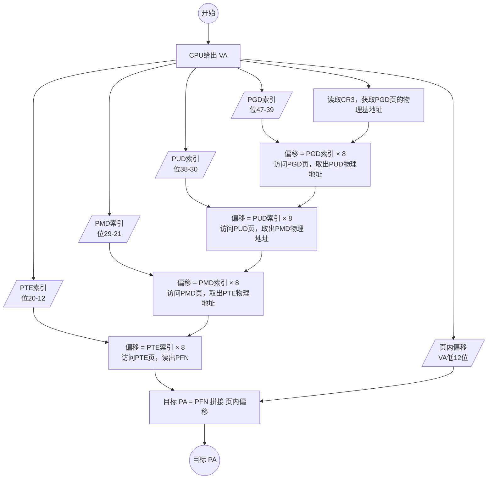
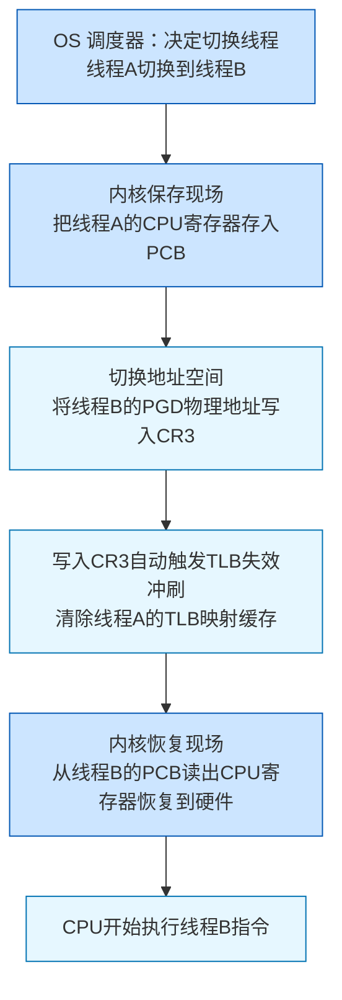
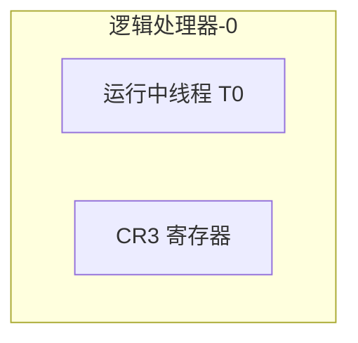
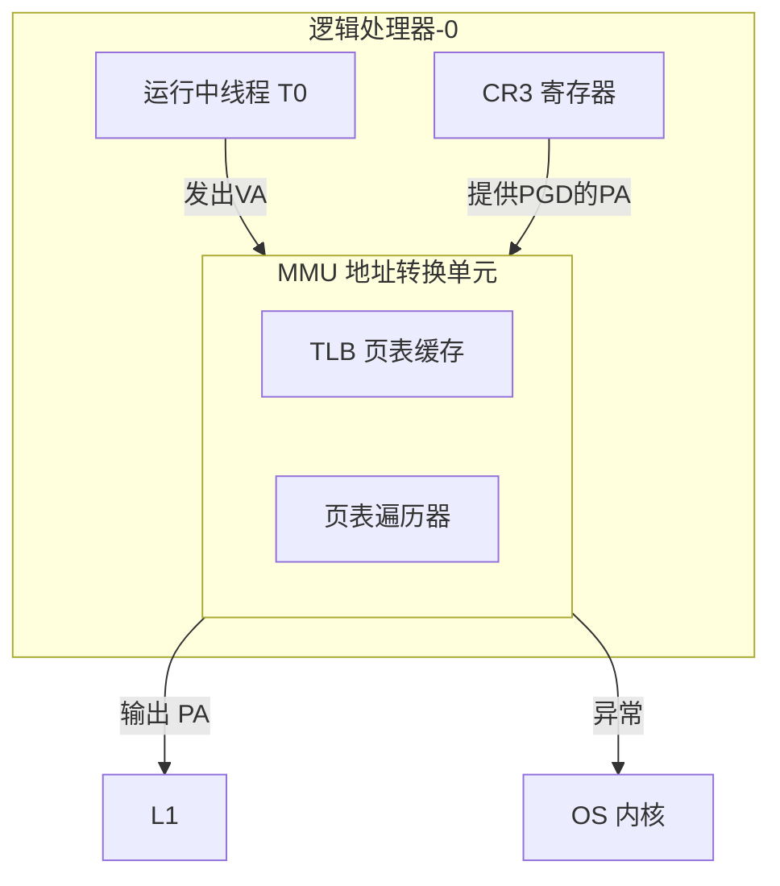
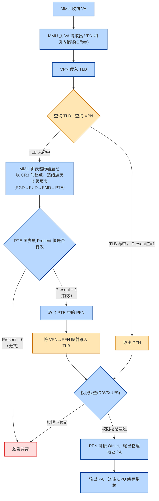
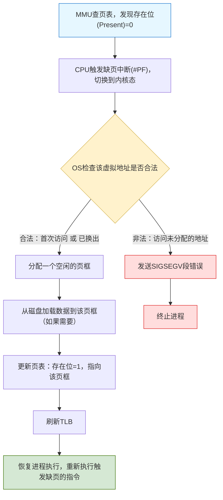
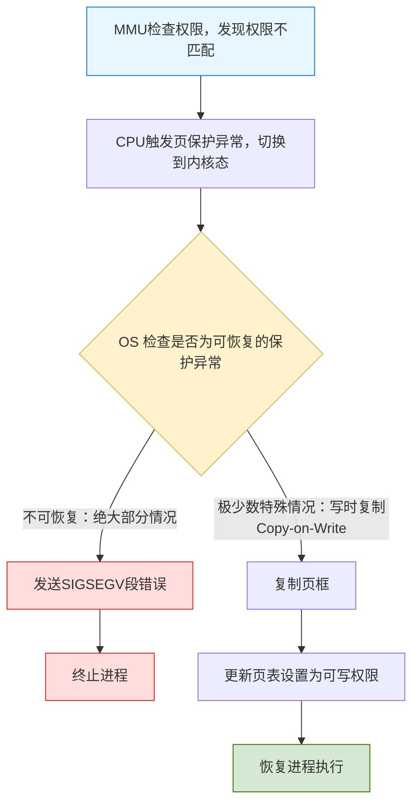
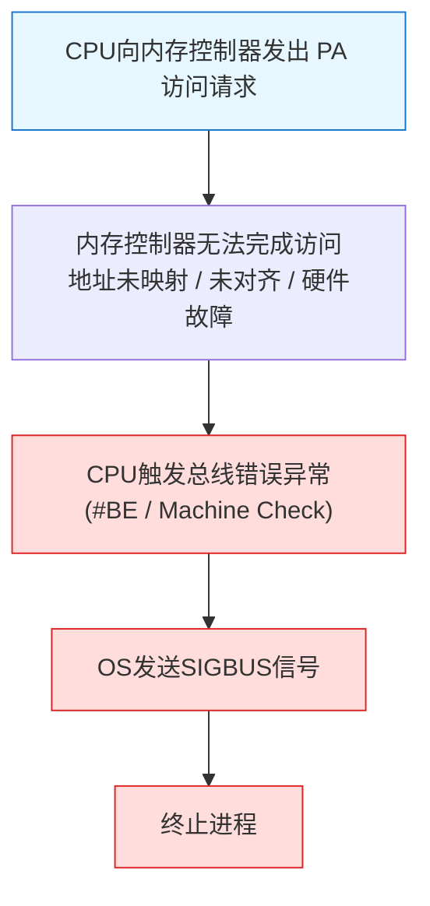
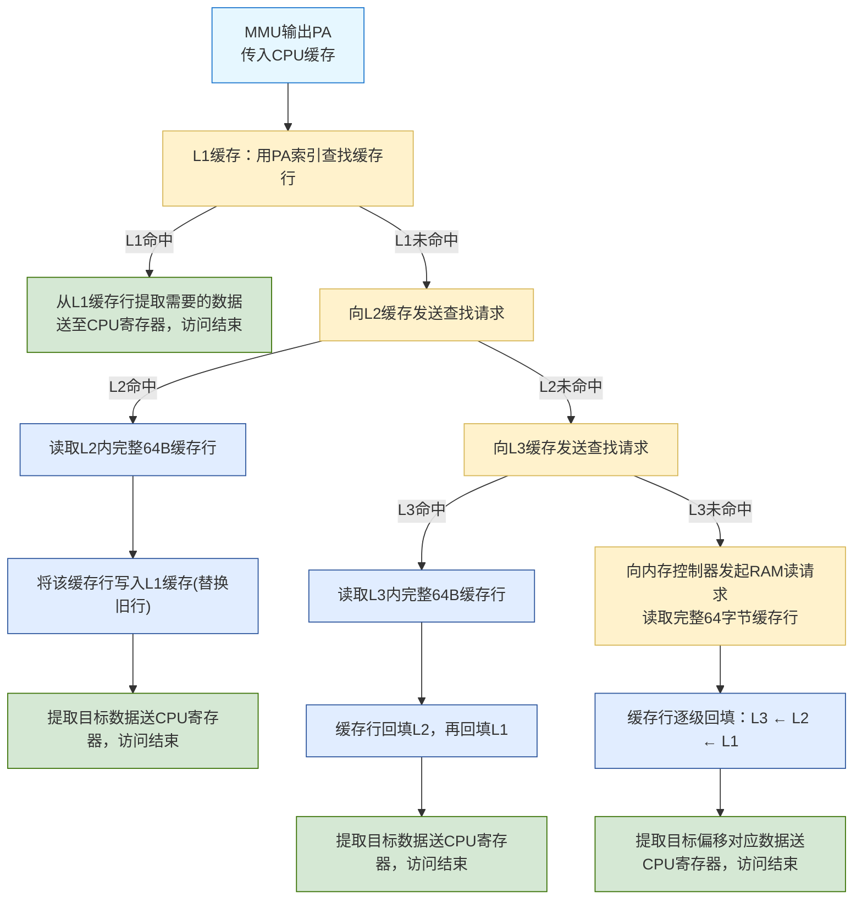

---
tags:
  - 分支
  - 受审状态/请求
  - 知识类型/底层
前置知识-最低: "[[MEaa1. 内存的深入理解]]"
updated: 2026-09-05
---
## 1. 多级页表

### 1.1 引入

再引入多级页表前，先让我们计算一下如果使用单级页表（即整个虚拟地址空间只用一张页表），一张页表需要多少内存空间：

对于 32 位系统，虚拟地址空间为 4GB。采用分页机制，每个页大小为 4KB，则页表需要的 PTE 数量为：
$$
4\text{GB} \div 4\text{KB} = 1,048,576 \text{（个 PTE）}
$$
每个 PTE 需要存储物理页框号（PFN）和权限位等信息，在 32 位系统中每个 PTE 通常占 4 字节。因此，一张完整的单级页表大小为：
$$
1,048,576 \times 4 = 4,194,304 \text{ B} = 4 \text{ MB}
$$
如果计算机中有 200 个进程（每个进程都需要自己独立的页表），则所有页表占用的总大小约为：
$$
4 \text{ MB} \times 200 = 800 \text{ MB}
$$
**4MB 一张页表，200 个进程就需要 800MB**——这对于 32 位系统来说已经是一个不小的开销了（接近物理内存的 1/4）。

更糟糕的是，**大多数进程并不会使用其全部 4GB 虚拟地址空间**。实际上，一个普通程序可能只使用了其中的几十 MB 或几百 MB，但单级页表仍然需要为整个 4GB 地址空间分配 4MB 的内存，哪怕其中绝大部分页表项都是无效的（即 Present 位 = 0）。

同理，对于 64 位系统，虚拟地址空间为 $2^{64}$ 字节（约 1600 万 TB），单级页表的大小将是天文数字，完全不可行。为了解决这个问题，我们需要**多级页表（Multi-Level Page Table）**。

### 1.2 多级页表的基本概念

多级页表不创建完整页表，而是只创建实际用到的部分。

**x86-64 下的四级页表结构：**

| 英文全称                           | 中文名称  | 每张表占物理内存 | 表项数量  | 每个表项大小 |
| ------------------------------ | :---: | :------: | :---: | :----: |
| **PGD**（Page Global Directory） | 页全局目录 |   4KB    | 512 个 |  8 字节  |
| **PUD**（Page Upper Directory）  | 页上级目录 |   4KB    | 512 个 |  8 字节  |
| **PMD**（Page Middle Directory） | 页中间目录 |   4KB    | 512 个 |  8 字节  |
| **PTE**（Page Table Entry）      |  页表项  |   4KB    | 512 个 |  8 字节  |
PGD, PUD, PMD 中每个表项存储有下一级目录或 PTE 的 PA。
PTE 中每个表项存储有 VA 对应的 PFN。

![[四级页表.png]]

整个查找过程：CR3 → PGD → PUD → PMD → PTE → 物理地址。

> [!TIP] **提示**：CR3
> CR3 是存在于每个逻辑处理器中的一个**寄存器**，用于存储当前进程的 PGD 的 PA，更多关于 CR3 的内容将在稍后学到。

> [!TIP] **提示**：x86-64
> **x86-64 是 x86 架构的 64 位扩展版本**，它是目前绝大多数台式机、笔记本和服务器的标准 64 位架构。

### 1.3 VA 的组成部分

在 x86-64 下，**VA（虚拟地址）**有 64 （比特）位：

| 位范围       | 字段名称      | 位宽   | 说明                                 |
| --------- | --------- | ---- | ---------------------------------- |
| **63-48** | 未使用（符号扩展） | 16 位 | 必须为位 47 的符号扩展（全 0 或全 1），否则触发规范地址异常 |
| **47-39** | PGD 索引    | 9 位  | 页全局目录（PGD）中的偏移，指向 PUD 页表           |
| **38-30** | PUD 索引    | 9 位  | 页上级目录（PUD）中的偏移，指向 PMD 页表           |
| **29-21** | PMD 索引    | 9 位  | 页中间目录（PMD）中的偏移，指向 PTE 页表           |
| **20-12** | PTE 索引    | 9 位  | 页表项（PTE）中的偏移，指向最终的物理页框号（PFN）       |
| **11-0**  | 页内偏移      | 12 位 | 在 4KB 页内的偏移量，地址翻译后**原封不动**传递给物理地址  |

VPN（虚拟页号）**是 VA 的组成部分，占 VA 的第 47-12 位，存储了各个页目录的索引。

比如对于 VA：`0xFFFFEF1234567890`（64 位 16 进制，每位 4 比特）
`0xFFFFEF1234567890` 展开为二进制（每 4 位一组，用 `_` 分隔，共 64 位）：
`1111_1111_1111_1111_1110_1111_0001_0010_0011_0100_0101_0110_0111_1000_1001_0000 `

| 字段     | 位范围   | 提取的二进制                | 十六进制     |
| ------ | ----- | --------------------- | -------- |
| 符号扩展   | 63-48 | `1111_1111_1111_1111` | `0xFFFF` |
| PGD 索引 | 47-39 | `1_1101_1110`         | `0x1DE`  |
| PUD 索引 | 38-30 | `0_0100_1000`         | `0x048`  |
| PMD 索引 | 29-21 | `1_1010_0010`         | `0x1A2`  |
| PTE 索引 | 20-12 | `1_0110_0111`         | `0x167`  |
| 页内偏移   | 11-0  | `1000_1001_0000`      | `0x890`  |

### 1.4 PA 的组成

在 x86-64 下，**PA（物理地址）** 的位数由 CPU 的具体实现决定（通常为 36~52 位）。为了与 VA 的 4KB 页框（12 位偏移）匹配，PA 的位宽定义为 `MAX_PHYSMEM_BITS`，常见值为 **52 位**（理论最大，实际 CPU 通常支持 46~52 位）。

| 位范围       | 字段名称         | 位宽   | 说明                                      |
| --------- | ------------ | ---- | --------------------------------------- |
| **63-52** | 未使用          | 12 位 | 必须全为 0，否则访问该物理地址会触发 \#GP 异常             |
| **51-12** | PFN          | 40 位 | 物理页框号，指向物理内存中的一个 4KB 页框（支持最大 64TB 物理内存） |
| **11-0**  | 页内偏移（Offset） | 12 位 | 与 VA 的页内偏移完全一致，地址翻译后**原封不动**传递到物理地址     |

> [!TIP] **提示**：不同 CPU 的 PFN 位数可能不同
> |CPU 系列|物理地址位数|PFN 位数|最大物理内存|
> |---|---|---|---|
> |Intel Core 2 / AMD K8|40 位|28 位|1 TB|
> |Intel Core i7 / AMD Zen 1|46 位|34 位|64 TB|
> |Intel Xeon (Skylake)|46 位|34 位|64 TB|
> |AMD Zen 3 / Intel Ice Lake|48 位|36 位|256 TB|
> |理论最大值（x86-64 规范允许上限）|52 位|40 位|4 PB|

例如对于一个 PA `0x000A470E3F19D890`：

| 字段   | 位范围   | 十六进制           | 来源                |
| ---- | ----- | -------------- | ----------------- |
| 符号扩展 | 63-52 | `0x000`        | 规定全部位为 0          |
| PFN  | 51-12 | `0xA470E3F19D` | 从 PTE 查得          |
| 页内偏移 | 11- 0 | `0x890`        | 从 VA 的第 11 - 0 复制 |

> [!NOTE] **概念**：`#GP` 异常
> `#GP` 是 **General Protection Fault（通用保护异常）** 的缩写，属于 x86 架构中的一种硬件异常。当 CPU 检测到特权级或内存访问违规时，会触发 `#GP`，操作系统会将该异常转化为 SIGSEGV 信号发送给进程。

### 1.5 多级页表的查找过程

CPU 根据 VA 查找目标 PA 的过程：

1. 根据 CR3 中存储的 PGD 的物理地址找到 PGD 页。
2. 从 VA 中取出 **PGD 索引**（位 47-39），在 PGD 页中以 **PGD 索引 × 8** 为偏移，找到对应的 PGD 条目，读出其中存储的 **PUD 页的物理地址**。
3. 从 VA 中取出 **PUD 索引**（位 38-30），在 PUD 页中以 **PUD 索引 × 8** 为偏移，找到对应的 PUD 条目，读出其中存储的 **PMD 页的物理地址**。
4. 从 VA 中取出 **PMD 索引**（位 29-21），在 PMD 页中以 **PMD 索引 × 8** 为偏移，找到对应的 PMD 条目，读出其中存储的 **PTE 页的物理地址**。
5. 从 VA 中取出 **PTE 索引**（位 20-12），在 PTE 页中以 **PTE 索引 × 8** 为偏移，找到对应的 PTE 条目，读出其中的 **物理页框号（PFN）**。
6. **目标 PA = PFN 拼接（追加）上页内偏移量（VA 的低 12 位）得到的结果。**

> [!QUESTION] **问题**：为什么需要以“索引 × 8”为偏移？
> 因为 64 位系统中，PTE / PMD/ PUD/ PGD 的每个条目均为 8 字节，例如 PGD 中：
> 
> |**PGD 索引**|**字节偏移（索引 × 8）**|**指向的 PUD 物理地址**|
|---|---|---|
| `0` | `0 - 7` |第 0 个 PUD 页表地址|
| `1` | `8 - 15` |第 1 个 PUD 页表地址|
| `2` | `16 - 23` |第 2 个 PUD 页表地址|
| `3` | `24 - 31` |第 3 个 PUD 页表地址|
| `...` | `...` | `...` |
| `511` | `4088 - 4095` |第 511 个 PUD 页表地址|

---

## 2. 进程访问内存的过程

![[内存访问流程图.jpeg]]

| 组件            | 颜色    | 说明                               |
| ------------- | ----- | -------------------------------- |
| **逻辑处理器**     | 🟣 紫色 | CPU 执行指令、AGU/ALU 地址生成、寄存器操作、数据加载 |
| **MMU**       | 🔵 蓝色 | 内存管理单元相关操作：地址翻译请求、页表遍历、权限检查      |
| **TLB**       | 🔷 青色 | 旁路转换缓冲相关操作：TLB查询、TLB填充、TLB失效冲刷   |
| **OS 内核**     | 🟠 橙色 | 内核调度、上下文切换、缺页中断处理、地址空间检查、信号处理    |
| **CPU 缓存**    | 🟢 绿色 | L1/L2/L3 缓存查找、缓存行填充与回填           |
| **成功/完成**     | 🟢 浅绿 | 指令执行成功完成                         |
| **异常/ OS 内核** | 🔴 红色 | 权限错误、非法访问、段错误、总线错误、进程崩溃          |
| **终端节点**      | 🟣 灰紫 | 流程开始 / 结束节点                      |

请先学习完本章节再看上图。

### 2.1 上下文切换、CR3 和 PCB

在一个逻辑处理器中，暂停当前正在运行的线程，保存其 CPU 状态（上下文），然后恢复另一个线程之前保存的 CPU 状态，使其继续执行的操作叫作“**上下文切换（Context Switch）**”（两个线程必须属于不同进程，否则属于线程切换），其流程图如下：

**PCB (Process Control Block，进程控制块）** 是 OS 内核为每个进程维护的一个**数据结构**，记录了进程的所有关键信息。它是 OS 管理进程的“身份证”，其保存的信息例如：

| 字段类别        | 包含内容                                |
| ----------- | ----------------------------------- |
| **进程标识**    | 进程 ID（PID）、父进程 ID（PPID）             |
| **状态信息**    | 当前状态（运行、就绪、阻塞等）                     |
| **内存管理信息**  | **页表基址（CR3 值）**、代码段/数据段指针、虚拟地址空间大小  |
| **CPU 上下文** | 寄存器值（通用寄存器、PC、栈指针等）——即进程被切换前保存的“快照” |
| **调度信息**    | 优先级、时间片、调度队列指针                      |
| **资源列表**    | 打开的文件描述符、信号处理器、环境变量等                |

这些信息都是进程运行时所需要的，所以上下文切换时需要保存和加载 PCB。

**CR3 寄存器**（Control Register 3）是 x86/x64 CPU 中的一个控制寄存器，它存在于每一个逻辑处理器中，存储了**当前进程的 PGD 的 PA**。

### 2.2 AGU 和 ALU

**ALU（算术逻辑单元，Arithmetic Logic Unit）**：逻辑处理器中的“计算器”，负责所有整数算术运算（`+`、`-`、`*`、`&`、`|`、`<<` 等）。

**AGU（地址生成单元，Address Generation Unit）**：逻辑处理器中的一个专门硬件单元，专门负责**地址生成**和**内存访问预处理**。

| 组件      | 全称                      | 核心职责                    | 在地址计算中的产出                         |
| ------- | ----------------------- | ----------------------- | --------------------------------- |
| **ALU** | Arithmetic Logic Unit   | 整数算术运算（`+`、`-`、`*`、移位等） | **有效地址（Effective Address）**（逻辑地址） |
| **AGU** | Address Generation Unit | 地址生成 + 段基址偏移 + 段界限检查    | **虚拟地址（Virtual Address）**（线性地址）   |

在计算 VA 上，它们经常协作工作，简单来说：ALU 负责“算数”（比如 base + index × scale + offset），算出一个有效地址；AGU 负责把这个有效地址加上段基址，生成最终的 VA，再交给 MMU。（关于它们的工作在本节“内存访问”的主题上不需要详细了解）

### 2.3 MMU 和 TLB

**MMU（Memory Management Unit，内存管理单元）** 是逻辑处理器内部的一个**硬件模块**，负责执行 VA 到 PA 的转换。

| 特征       | 说明                                     |
| -------- | -------------------------------------- |
| **位置**   | 逻辑处理器内部                                |
| **核心职责** | 将 CPU 发出的 VA 转换为 PA                    |
| **输入**   | VA（来自 CPU 执行单元） + PGD 的 PA（来自 CR3 寄存器） |
| **输出**   | PA（用于访问物理内存 RAM）或 页错误异常（Page Fault）    |
| **操作对象** | 页表                                     |

**TLB （Translation Lookaside Buffer，转换后备缓冲器，也称“快表”）** 是 MMU 内部的一个**小型高速缓存**，专门用于缓存最近使用的 **VPN → PFN** 映射关系。它存储的数据结构和 PTE 非常相似，只是少了一些字段：

| 字段                     | PTE 是否存在     | TLB 条目是否存在    | 说明           |
| ---------------------- | ------------ | ------------- | ------------ |
| **PFN（物理页框号）**         | ✅ 是          | ✅ 是           | 核心映射数据       |
| **权限位（R/W/X）**         | ✅ 是          | ✅ 是           | 硬件需要检查       |
| **U/S（用户/系统）**         | ✅ 是          | ✅ 是           | 硬件需要检查       |
| **VPN（虚拟页号）**          | ❌ 否（由索引隐式确定） | ✅ **是（显式存储）** | TLB 需要标签来匹配  |
| **Present（存在位）**       | ✅ 是          | ❌ 否           | 只有有效页才进入 TLB |
| **Accessed / Dirty**   | ✅ 是          | ❌ 否           | 纯 OS 管理，硬件不查 |
| **Software Available** | ✅ 是          | ❌ 否           | 纯 OS 自定义字段   |
| **ASID（地址空间 ID）**      | ❌ 否          | ✅ 是（可选）       | 硬件需要区分不同进程   |

> 需要注意的是：当发生上下文切换（写入 CR3）时，TLB 中当前进程的所有非全局条目会被**标记为失效**（称为 TLB flush，TLB 刷新 / TLB 冲刷），以确保新进程的地址空间不受旧映射干扰。但 OS 可以标记某些关键页为**全局页（Global Page）**，使其在上下文切换时不被冲刷，从而提升性能（如内核代码页）。

以下蓝色流程为 MMU 的操作，橙色流程为 TLB 的操作：

### 2.4 异常处理

在内存访问过程中，MMU 和 CPU 会遇到三种需要操作系统介入的“异常情况”：**缺页中断（Page Fault）**、**页保护异常（Protection Fault）** 和 **总线错误（Bus Error）**。它们统称为“内存异常”。

内存异常是“内存访问失败”时，硬件主动通知操作系统的事件。操作系统捕获后，要么修正问题让程序继续运行，要么终止进程以防止错误扩散。这是虚拟内存实现按需加载、交换、权限控制和进程隔离的核心机制。

#### 2.4.1 缺页中断（Page Fault）

**缺页中断**发生在 MMU 遍历页表时，发现目标页表项的 **存在位（Present / Valid）** 为 `0` 时。这意味着该虚拟页当前**不在物理内存中**。

|触发条件|存在位 `= 0` |
|---|---|
|**处理者**|操作系统内核的缺页中断处理程序|
|**典型场景**|① 该页被换出到交换区（Swap）   ② 该页尚未被分配（如首次访问堆/栈）   ③ 访问了未映射的虚拟地址（非法）|

缺页中断是虚拟内存“按需加载”和“换入换出”机制的硬件支撑。没有它，虚拟内存就无法实现“虚拟地址空间大于物理内存”的能力。

#### 2.4.2 页保护异常（Protection Fault）

**页保护异常**发生在 MMU 检查页表项的**权限位（R/W/X/U/S）**时，发现当前操作不满足权限要求。

| 触发条件     | 权限位不匹配（如写只读页，或在不可执行页上执行代码）                                                       |
| -------- | -------------------------------------------------------------------------------- |
| **处理者**  | 操作系统内核的保护异常处理程序                                                                  |
| **典型场景** | ① 尝试写入 `.rodata` 段（只读）   ② 尝试在栈上执行代码（`NX` 保护）   ③ 用户态程序访问内核态页（`U/S` 位检查失败） |

> [!TIP] **提示**：页保护异常和缺页中断的区别
> 1. 缺页中断是“页不存在于内存中”（存在位为 0），处理的是“有没有”的问题。
> 2. 页保护异常是“页存在于内存中，但权限不允许当前操作”，处理的是“能不能”的问题。

#### 2.4.3 总线错误（Bus Error）

**总线错误**是比页表异常更底层的硬件异常。它发生在 CPU 向内存控制器发出物理地址访问请求时，硬件层面无法完成该请求。

| 触发条件     | 硬件无法访问指定的物理地址                                                                   |
| -------- | ------------------------------------------------------------------------------- |
| **处理者**  | 操作系统内核的总线错误处理程序                                                                 |
| **典型场景** | ① 物理地址未映射到任何硬件设备（访问不存在的内存区域）   ② 物理地址对齐错误（如某些 ARM 平台强制对齐）   ③ 硬件故障（内存条损坏） |

> [!TIP] **提示**： 总线错误与页表异常的区别
> 1. 页表异常是由 MMU 查页表时主动触发的（属于“预期内”的管理事件），是 OS 可以部分恢复的
> 2. 总线错误是 CPU 访问 PA 时硬件层面报错（属于“意外”的硬件事件），几乎总是致命错误。

| 对比维度     | SIGSEGV（段错误）            | SIGBUS（总线错误）      |
| -------- | ----------------------- | ----------------- |
| **触发层级** | MMU 查页表时触发              | 内存控制器访问 PA 时触发    |
| **根本原因** | 页表项不存在 / 权限不匹配（逻辑层面的错误） | PA 无法访问（硬件层面的错误）  |
| **常见场景** | 空指针解引用、写只读段、执行不可执行页     | PA 未对齐、内存条损坏、硬件故障 |
| **信号编号** | 11                      | 10（某些平台为 7）       |
| **能否恢复** | 通常不可恢复（除非信号处理程序捕获并修复）   | 几乎不可恢复            |

#### 2.4.4 异常与未定义行为

C++ 的未定义行为，从内存模型的角度看，大多数都可以追溯到两类硬件异常：

- **缺页中断（非法地址访问）**——对应 SIGSEGV
- **页保护异常（权限违规）**——对应 SIGSEGV

|C++ 未定义行为|触发条件|硬件异常|结果|
|---|---|---|---|
|**解引用空指针**| `int* p = nullptr; *p = 5;` |缺页中断（非法地址）|SIGSEGV|
|**解引用野指针（指向已释放内存）**| `delete p; *p = 5;` |缺页中断 / 页保护异常|SIGSEGV（可能不立即触发）|
|**数组越界访问**| `int arr[5]; arr[10] = 1;` |缺页中断（非法地址，如越界过远）|SIGSEGV（有时能“侥幸”跑通，但数据被破坏）|
|**写入只读内存**|修改 `.rodata`（字符串字面量）|页保护异常（R/W 位）|SIGSEGV|
|**在栈/堆上执行代码**|跳转到栈上的 buffer|页保护异常（NX 位）|SIGSEGV（现代系统）|
|**用户态访问内核空间**| `*(int*)0xFFFF800000000000 = 1;` |页保护异常（U/S 位）|SIGSEGV|
|**栈溢出（过深递归）**|递归无限调用|缺页中断（访问未映射的栈底）|SIGSEGV|
|**已释放内存的双重释放**| `delete p; delete p;` |取决于内存状态：   ① 释放后内存被重新分配 → 数据破坏（不立即崩溃）   ② 释放后内存映射被取消 → 缺页中断（SIGSEGV）|可能崩溃，也可能数据损坏|
|**访问未初始化的局部变量**| `int x; int y = x;` |❌ 不会触发硬件异常|结果不确定（通常不崩溃）|
|**有符号整数溢出**| `int x = INT_MAX; x++;` |❌ 不会触发硬件异常|结果不确定（通常不崩溃）|
|**除以零（整数）**| `int x = 5 / 0;` |❌ 不会触发硬件异常（但可能触发 CPU 陷阱）|通常崩溃（但不是 SIGSEGV）|

C++ 中最危险的未定义行为（UB） 大多涉及 **指针操作**（解引用、越界、野指针、写只读段），而指针操作最终都会落到 CPU 的访存指令上。一旦访存指令发出的 VA 在页表中找不到有效映射（或缺页中断后判定为非法），MMU 就会触发页保护异常或非法缺页中断，OS 将其转化为 SIGSEGV。

从另一个角度看，C++ 的另一大类 UB（如整数溢出、移位越界、未初始化变量）**不会触发硬件异常**——它们只会产生“错误的值”，程序继续运行，可能几小时后才崩溃。这类 UB 更难调试，因为它们不立即产生信号。

> [!QUESTION] **问题**：为什么数组越界不一定立即崩溃？
> 数组越界访问时，只要目标地址仍然落在进程已映射的 VA 范围内（且权限位允许写入），MMU 就不会触发任何异常，程序会静默地修改相邻内存数据。只有当越界地址超出了进程已映射的虚拟地址空间（如访问到未分配的页）时，才会触发缺页中断，进而产生 SIGSEGV。
>
> 这是 C++ 中“未定义行为”最危险的地方：它可能不会立即出错，而是“潜伏”到很久之后才崩溃。

### 3.5 CPU 缓存

CPU 的执行速度远快于内存的访问速度——CPU 每秒可执行数十亿条指令，而内存的访问延迟通常在 50~100ns（相当于几百个 CPU 周期）。为了弥补这个速度差异，CPU 内部引入了**缓存（Cache）**：一种比内存更快、容量更小的存储器。

#### 3.5.1 存层次结构 L1 / L2 / L3

现代 CPU 通常采用**三级缓存（L1、L2、L3）** 结构。越靠近 CPU 核心（如 L1），缓存速度越快、容量越小、成本越高。

| 级别          | 全称            | 位置                 | 访问延迟（约）                | 特点                           |
| ----------- | ------------- | ------------------ | ---------------------- | ---------------------------- |
| **L1**      | Level 1 Cache | 每个逻辑处理器私有          | ~1ns（1~3 周期）           | 最快，最小，分指令缓存（L1-I）和数据缓存（L1-D） |
| **L2**      | Level 2 Cache | 每个逻辑处理器私有（或每个内核私有） | ~3ns（~10 周期）           | 次快，次小，通常统一存放指令和数据            |
| **L3**      | Level 3 Cache | 所有内核共享             | ~10ns（~40 周期）          | 较慢，较大，所有核心共享，也称“末级缓存（LLC）”   |
| **内存（RAM）** | Main Memory   | 所有内核共享             | ~60~100ns（~200~400 周期） | 最慢，最大                        |

#### 3.5.2 缓存的工作流程

当 CPU 执行一条访存指令时，缓存系统的工作流程如下：

如果 CPU 需要读取的某个数据，在 L1、L2、L3 缓存中都能找到，则分别称为 **L1 命中（L1 Hit）**、**L2 命中（L2 Hit）**、**L3 命中（L3 Hit）**；如果在三级缓存中都没有找到，则称为 **缓存未命中（Cache Miss）**，此时 CPU 必须从物理内存（RAM）中读取数据。

由于程序的**局部性原理**（一段时间内访问的地址往往集中在一个小范围内），L1 缓存的命中率通常高达 90% 以上。

#### 3.5.3 缓存行 Cache Line

**缓存行（Cache Line）是 CPU 缓存和主存（RAM）之间进行数据交换的最小单位。**

也就是说，CPU 从内存读数据，不是按 `int`（4 字节）或 `char`（1 字节）来读的，而是**每次强制读一整块**。这一整块就叫“缓存行”，**大小固定为 64 字节**（这是 x86/x64 架构的标准，ARM 也大多是 64 字节）。

> [!QUESTION] **问题**：为什么是 64 字节？
> 因为程序倾向于访问**相邻的内存地址**（比如遍历数组、顺序执行指令），也就是说如果 CPU 一次读了某个内存地址，那么下次很可能还会读相邻的内存地址。
> 
> 相反，如果 CPU 每次只读 4 字节，那么下一次访问相邻的 4 字节又要去内存读取，速度极慢。

一个缓存行不是“只有 64 字节数据”，它在硬件上是一个**包含标签和状态位的完整记录**。缓存行条目会包含多个部分：

| 字段                      | 大小               | 作用                                                                       | 示例                |
| ----------------------- | ---------------- | ------------------------------------------------------------------------ | ----------------- |
| **Tag（标签）**             | 40~52 位（取决于 CPU） | 存储该缓存行所对应的**物理地址的高位**，用于判断该行是否匹配当前请求地址。                                  | `0xABCDE`（物理地址高位） |
| **Data（数据块）**           | **512 位（64 字节）** | 实际存储从内存中拷贝过来的数据。                                                         | 我们在程序里定义的变量       |
| **Valid（有效位）**          | 1 位              | 标记该缓存行是否包含有效数据（1=有效，0=无效/刚启动时的空状态）。                                      | `1`               |
| **Dirty（脏位）**           | 1 位（仅数据缓存）       | 标记该缓存行的数据是否已被 CPU **修改过**但尚未写回主存（1=脏，需写回；0=干净）。                          | `0`（刚读入，未修改）      |
| **（可选）E 位 / Shared 状态** | 2 位（MESI 协议）     | 在多核系统中，标记该缓存行是独占（Exclusive）、共享（Shared）还是已修改（Modified）。保证各逻辑处理器的 L1 缓存一致。 | `S`（共享状态）         |

当用 PA 匹配对应的缓存行条目时，会先用 PA 的 PFN 和 Tag 对应，当对应成功后，会再用 PA 的 Offset 的高 6 位（$2^6 = 64 \text{ 字节}$，这里 Offset 的每位表示 1 字节）来确定从 Data 中取哪些字节。

---

## 4. 回收开头问题

现在，你已经掌握了进程、线程、虚拟内存、分页、页表、缓存等核心概念，我们可以回到开头任务管理器截图中，解读其中一些信息背后的含义。

### 4.1 CPU 选项卡

![[任务管理器-CPU.png]]

| 项目        | 截图数值      | 含义（基于本文档知识）                                                                                                                                                                                                         |
| --------- | --------- | ------------------------------------------------------------------------------------------------------------------------------------------------------------------------------------------------------------------- |
| **内核**    | `16`      | 这颗 CPU 芯片内部包含 **16 个物理内核（Core）**。每个内核是独立的计算单元，拥有自己的 L1/L2 缓存，可以并行执行指令。参见 [[#3.5.1 存层次结构 L1 / L2 / L3]]。                                                                                                             |
| **线程**    | `6067`    | 系统中**当前存在的线程总数**（所有进程的线程之和）。注意：这不是 CPU 硬件支持的最大线程数（逻辑处理器），而是操作系统层面当前已创建的线程数量。每个进程至少有一个线程，参见 [[MEaa1. 内存的深入理解#1.3 线程 Thread\|MMaa1-1.3.线程 Thread]] ——线程是 CPU 调度的最小单位，OS 调度器在这些线程之间分配时间片。                              |
| **逻辑处理器** | `32`      | 硬件支持的**并行执行单元总数**。由于本机 CPU 支持**超线程（Hyper-Threading）**技术，每个物理核心可以提供 2 个逻辑处理器，因此 `16 核 × 2 = 32 逻辑处理器`。每个逻辑处理器在操作系统看来都是一个可以独立调度执行线程的“虚拟 CPU 核心”，同一时刻能执行一个线程。参见 [[MEaa1. 内存的深入理解#1.3 线程 Thread\|MMaa1-1.3.线程 Thread]]。 |
| **L1 缓存** | `1.0 MB`  | **L1 缓存总容量**。每个逻辑处理器私有，分为指令缓存（L1-I）和数据缓存（L1-D）。总容量 = `32 逻辑处理器 × 32KB/个 ≈ 1.0 MB`。参见 [[#3.5.1 存层次结构 L1 / L2 / L3]]。                                                                                                 |
| **L2 缓存** | `16.0 MB` | **L2 缓存总容量**。通常每个物理核心私有（或每个逻辑处理器私有），`16 核心 × 1MB/个 = 16 MB`。访问延迟约 3ns（~10 周期），比 L1 慢但比 L3 快。参见 [[#3.5.1 存层次结构 L1 / L2 / L3]]。                                                                                       |
| **L3 缓存** | `64.0 MB` | **L3 缓存总容量**。所有 16 个核心共享，也称**末级缓存（LLC, Last Level Cache）**。访问延迟约 10ns（~40 周期），是所有核心之间数据共享和缓存一致性协调的关键。参见 [[#3.5.1 存层次结构 L1 / L2 / L3]]。                                                                              |

### 4.2 内存选项卡

> ![[任务管理器-RAM.png]]

| 项目           | 截图数值               | 含义（基于本文档知识）                                                                                                                                                                                                                                                                                                                               |
| ------------ | ------------------ | ----------------------------------------------------------------------------------------------------------------------------------------------------------------------------------------------------------------------------------------------------------------------------------------------------------------------------------------- |
| **使用中（已压缩）** | `11.1 GB (136 MB)` | **当前物理内存中被进程和 OS 占用的总量**。其中括号内的 `136 MB` 是 Windows 内存压缩功能压缩掉的数据量——OS 会将部分物理内存页压缩后存放在 RAM 中，变相节省物理内存空间，减少磁盘换入换出。这与本文档的 [[MEaa1. 内存的深入理解#3.1 虚拟内存的基本概念\|MEaa1-3.1 虚拟内存的基本概念]] 中“以时间换空间”的思路一致：压缩/解压消耗 CPU 时间，但换来了更少的磁盘 I/O。                                                                                                                  |
| **可用**       | `20.6 GB`          | **当前物理内存中可立即分配给进程的空闲页框总量**。包括空闲页框 + 待回收的缓存页框。若某个页框被用作文件缓存（Cache），但尚未被写回磁盘且未被进程锁定，则仍会计入“可用”。当进程申请新内存时，OS 会优先使用这部分物理内存。这与本文档 [[MEaa1. 内存的深入理解#4.2 页框 Page Frame\|MEaa1-4.2 页框 Page Frame]] 中“页框是物理内存的分配单元”相对应。                                                                                                                              |
| **已提交**      | `13.9/33.7 GB`     | **当前系统所有进程已承诺的虚拟内存总量（物理 RAM + 交换区之和）**。前值 `13.9 GB` 表示所有进程当前已分配的虚拟地址空间总和（包含实际驻留物理内存的页 + 已换出到磁盘的页），后值 `33.7 GB` 表示系统当前可用的总提交限额（物理 RAM 总量 + 交换区（Swap）大小）。本文档 [[MEaa1. 内存的深入理解#3.1 虚拟内存的基本概念\|MEaa1-3.1 虚拟内存的基本概念]] 中提到 OS 通过换入换出实现“虚拟内存大于物理内存”——已提交总量可以超过物理内存 `31.7 GB`（`11.1 + 20.6`），因为部分虚拟内存页可能被换出到磁盘上的交换区。                              |
| **已缓存**      | `13.0 GB`          | **当前用作文件系统缓存（Page Cache）的物理内存大小**。这部分内存存储了最近从磁盘读取的文件数据，或等待写回磁盘的数据。缓存利用了程序的**局部性原理**（参见 [[#3.5.3 缓存行 Cache Line]] 中的局部性原理），加速磁盘 I/O。当进程需要更多内存时，OS 可回收这部分缓存页框分配给进程（此时“可用”内存会增加），因此，“已缓存”的内存既不完全属于“使用中”，也不完全属于“可用”，而是处于一个中间状态，OS 可根据内存压力随时回收这部分空间。这与本文档 [[MEaa1. 内存的深入理解#3.1 虚拟内存的基本概念\|MEaa1-3.1 虚拟内存的基本概念]] 中换入换出机制相关：缓存页可以理解为内存与磁盘之间的加速层。 |
| **为硬件保留的内存** | `320 MB`           | **BIOS/固件、硬件设备（如核显、网卡）、以及 OS 内核自身使用的物理内存**，这部分内存被永久锁定，OS 无法将其分配给用户态进程。本文档 [[MEaa1. 内存的深入理解#4.3 页表 Page Table\|MEaa1-4.3 页表 Page Table]] 中 U/S 位为 0 的页（内核态）和部分硬件 MMIO 区域属于此范畴。320 MB 是典型的集成显卡共享显存或内核关键数据结构占用。                                                                                                                              |
| **分页缓冲池**    | `673 MB`           | **分页池（Paged Pool）**：内核态内存中可以被换出到磁盘的页面（如文件系统缓存、部分内核数据结构）。这些页面与用户态进程的虚拟页一样，遵守分页机制，在物理内存紧张时可以被换出到交换区。参见 [[MEaa1. 内存的深入理解#3.1 虚拟内存的基本概念\|MEaa1-3.1 虚拟内存的基本概念]] ——分页池中的页的 PTE 存在位可能为 0（被换出）。                                                                                                                                                   |
| **非分页缓冲池**   | `779 MB`           | **非分页池（Non-Paged Pool）**：内核态内存中**永远不能被换出到磁盘**的页面。这些页面必须始终驻留在物理内存中，否则会导致系统崩溃（如中断处理程序、DMA 缓冲区、部分设备驱动代码）。它们的 PTE 存在位始终为 1，且通常 U/S 位为 0（内核态）。参见 [[MEaa1. 内存的深入理解#4.3 页表 Page Table\|MEaa1-4.3 页表 Page Table]] 中 U/S 权限位与内存隔离的描述。                                                                                                              |

任务管理器中的这些数字，本质上是**操作系统对物理内存页框、虚拟内存页、页表项（PTE）、TLB 和 CPU 缓存进行综合管理**的实时状态（快照）。每一处数值背后，都对应着硬件（MMU、CR3、TLB、缓存）与软件（OS 内存管理器、调度器、缺页中断处理程序）的协同运作。

你现在已经能够读懂这些数字背后的一部分底层逻辑了。
