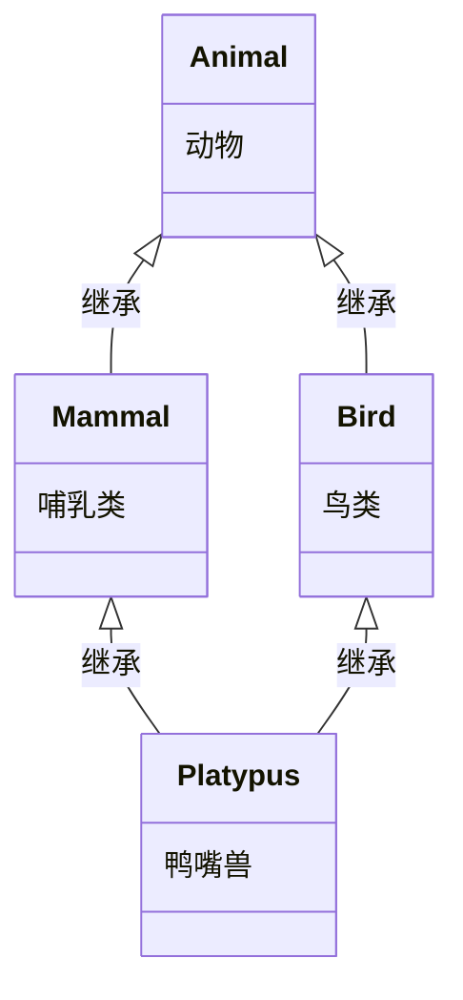

# 快速上手 Obsidian

> 本教程创建时间：2026-9-12

> 本教程旨在教你快速学会使用 Obsidian 学习本套课程。

---

## 1. 下载、安装 Obsidian

1. 访问 [Obsidian 官网](https://obsidian.md/zh/download) ，下载对应你电脑的操作系统的安装包。

![[Obsidian官网页面.png|700]]

> [!TIP] **提示**：关于下载
> Obsidian 的官网的安装包是从 github 下载的，你可能因为无法访问 github 而下载失败。如果遇上此情况，请在其他时间重新尝试，或尝试加速。
> 
> 或者，你也可以从百度网盘下载（网盘提供的安装包为 2026-8-12 更新的 1.13.7 版本。）：
> 
> 链接: https://pan.baidu.com/s/1vVUrynL_MfDj5l-A72kBbA?pwd=0000
> 提取码：0000

> [!TIP] **提示**：关于在手机上使用 Obsidian
> 访问官网，你能发现 Obsidian 也提供了移动端的安装包。但我建议仅使用移动端的 Obsidian 来阅读，而非写作。本教程不提供移动端的使用指导。

2. 运行下载的安装包，如果你找不到下载的文件，尝试从 `C:/用户/你的用户名/下载` 找到。

3. 如果这是你的个人电脑，你可以选择以下的任意选项，否则建议你选择“仅为我安装”。然后点击“下一步”。

![[为哪位用户安装该应用.png]]

4. 按照你安装位置的偏好选择目标文件夹，然后点击“*安装*”，等待安装完成。

![[选定安装位置.png]]

5. 点击“*完成*”。

![[安装完成.png]]

6. 此时你的桌面应该出现 Obsidian 的快捷方式，若没出现，请继续完成本章的步骤。

![[桌面上的 Obsidian 快捷方式.png]]

7. 打开你刚才安装 Obsidian 的文件夹，如果你没修改安装位置，则应该在以下的位置之一：

- `C:\Program Files\Obsidian`
- `C:\Users\你的用户名\AppData\Local\Programs\Obsidian`

8. 在 Obsidian 的安装文件夹中右键点击 *`Obsidian.exe`*，在弹出的右键菜单中左键点击“*创建快捷方式*”（图中红框表示左键点击，绿框表示右键点击）。

![[Obsidian.exe的右键菜单.png]]

9. 将当前文件夹中的 `Obsidian.exe - 快捷方式`  移动或剪贴到桌面。（可选，根据自己的偏好重命名该快捷方式）

![[移动快捷方式.png]]

---

> [!TIP] **提示**：可能的情况
> 如果你已经通过 `git clone` 指令克隆仓库到了你的电脑，请跳转至 [[快速上手 Obsidian#^two-five|第二章-第 5 步]] 。

## 2. 配置笔记仓库

1. 访问 [C++ 教程](https://gitee.com/tianguo602/CppTutorial) （可以是 Gitee 或 Github，这里以 Gitee 为例）仓库，点击“*克隆/下载*”。

![[C++ 教程仓库.png]]

2. 在弹出的窗口中，点击“*下载ZIP*”

![[下载ZIP.png]]

3. 完成接下来可能出现的人机验证，然后（在你刚才找到 Obsidian 安装包的地方）找到你下载压缩包，右键点击 *`CppTutorial-main.zip`*，在弹出来的右键菜单中点击“*全部解压缩*”。

![[准备解压.png]]

4. 根据自己的偏好，将压缩包解压到自己找得到也方便找的地方。

![[解压.png]]

5. 打开 Obsidian ，在弹出的界面中点击“*打开*”。 ^two-five

> [!TIP] **提示**：可能的情况
> 如果打开 Obsidian 后没出现以下图片中的界面，则请转跳至 [[#分支1]] 。

![[开始配置笔记仓库.png]]

6. 在弹出的窗口中，找到并选中自己解压出来的文件夹（或克隆到的文件夹），此时下方蓝框中的文本应该为你解压到的文件夹的名字，点击右下角的“*选择文件夹*”。

![[选择文件夹.png]]

7. 现在，你应该能看到弹出了以下图片中的窗口，本章节完成。

> [!TIP] **提示**：可能的情况
> 若没有出现以下图片中的窗口，请按照原顺序继续学习本教程的 [[#3.1 笔记仓库]] 。

![[第二章结束.png]]

---

## 3. 使用 Obsidian

本章节开始，我们将开始学习 Obsidian 的使用。

> [!TIP] **提示**：关于“文档”和“笔记”
> 你接下来会发现我一会用“文档”这个词，一会用“笔记”这个词，你在这里可以认为它们是同一个东西，如果你确实想了解两个词的区别的话：
> 
> - “文档”，指的是所有可以以文本形式供人阅读的文件。
> - “笔记”，指的是 `.md` 扩展名的文件，即 Markdown 文件，这也是我们在 Obsidian 中最常接触到的文件。
#issue
### 3.1 软件界面的布局

![[软件界面的布局.png]]

#### 3.1.1 整体布局

**布局**：

软件界面分为三个大区和一个小区，从左至右依次为：功能丝带（黑、小区）、左侧边栏（橙）、工作区（深红）、右侧边栏（橙）。

**侧边栏的状态**：

Obsidian 的侧边栏是可以展开 / 收起（折叠）的，要在这两种状态间切换，请点击“*展开 / 收起侧边栏按钮*”。

**改变侧边栏、工作区的宽度**：

如果你认为侧边栏较窄或工作区较窄，请将鼠标光标（箭头）移动至侧边栏和工作区的分界线，此时你能发现边界线变粗且颜色发生改变，现在按住鼠标左键并拖拽即可。

#### 3.1.2 左侧边栏

**操作笔记仓库**：

左侧边栏中左下角为当前笔记仓库的名字（黄），左键点击此处，会弹出仓库列表和“管理仓库”按钮，可通过这两者实现笔记仓库的 切换 / 创建 / 移除 / 添加 / 重命名 等功能。

**设置**：

左侧边栏中右下角为“设置”按钮（紫），点击此处以打开设置页面。

**顶部按钮**：

左侧边栏中顶部有三个按钮，从左到右依次为：文件列表（绿）、搜索（天蓝）、书签（深蓝），左键点击这些按钮可以让左侧边栏显示对应的视图，右键点击这些按钮可以关闭（隐藏）该按钮。若关闭按钮后需重新打开，请按 `Ctrl` + `P` 或 `Cmd` + `P` 以打开命令面板，然后：

- 若要打开“文件列表”，请输入并选中“显示文件列表”。
- 若要打开“搜索”，请输入并选中“在所有文档中搜索”。
- 若要打开“书签”，请输入并选中“显示书签列表”。

**文件列表**：

在文件列表中，你可以**打开**、**管理**笔记仓库中的文档，一般文件列表中有文档和文件夹这两种对象，文件夹的左边有形似 `>` 的箭头。

- 左键点击文档即可在工作区**显示**该文档，左键拖拽文档即可**移动**文档，右键点击文档即可在弹出的右键菜单中**管理**文档。
- 左键点击文件夹即可在工作区**展开、折叠**文件夹内的文档，左键拖拽文件夹即可**移动**文件夹，右键点击文件夹即可在弹出的右键菜单中**管理**文件夹。

#### 3.1.3 工作区

**标签页和标签页栏**：

工作区就是我们平时阅读、编辑文档的地方，如图所示，你从左侧的文件列表中选中的文档会出现在工作区顶部的标签页栏（灰）中，当你选中其中的标签页（橙）时，文档内容就会显示在工作区中。

你会发现，当你从左侧的文件列表中选中文档时，当前的标签页会被替换，而非在标签页栏中出现第二个标签页。要想实现后者，请按住文件列表中的文档，并拖拽到标签页栏中。 ^tabs

**历史导航按钮**：

现在请关闭所有标签页，并打开任意一个文档 a，再在 a 的工作区中翻阅（向下滚动），然后再在文件列表中点击其他文档 b，现在你能发现 a 的标签页替换为了 b 的标签页。如果你想重新显示 a，并且回到之前 a 的阅览进度，点击工作区左上角的左边的历史导航按钮（绿）即可。

**视图模式切换按钮**：

点击工作区右上角的视图模式切换按钮（棕）即可在“阅读视图”和“实时阅览”模式间切换。

- 实时阅览模式时，你可以编辑文档，也能够实时查看渲染效果（Obsidian 的文档一般是 markdown 文件，markdown 文件经过渲染才方便阅读，如果你想查看没渲染的文档请转跳至 [[#^src-mode|3.1.4 右侧边栏-视图模式切换按钮]]）。
- 阅览视图模式时，你不可以编辑文档，但能获得更好的渲染效果。

#### 3.1.4 右侧边栏

> [!TIP] **提示**：左右侧边栏的区别
> 左侧边显示的是**整个笔记仓库**的信息，而右侧边栏显示的则大多是当前工作区中你**选中的文档**的信息。

**状态栏**：

右侧边栏下方为状态栏（黄），显示当前工作区中选中的文档的信息。

**视图模式切换按钮**：

右侧边栏的下方的状态栏中也有视图模式切换按钮（灰），和之前工作区的视图模式切换按不同的是，这里可以切换到“源码模式”，在源码模式中，你可以编辑文档，但文档不再被渲染。 ^src-mode

视图模式切换快捷键：

- `Ctrl` + `E` 或 `Cmd` + `E`：在“阅读视图”和“实时阅览之间切换”

**大纲**（**==重要==**）：

右侧边栏顶部三条横向的按钮为大纲按钮（黑），点击此按钮，右侧边栏中会显示当前文档的标题结构，点击其中的标题，即可跳转至文档中对应的内容。

**链接**：

在文档中，你能看到如右侧括号中的有特殊颜色的字体（[[#3.1.4 右侧边栏]]），点击这种字体即可转跳至其他内容，这叫作“**链接**”，它是 Obsidian 中一种很重要的东西，文档（笔记）间通过链接建立联系，即可发展为知识网络，请善用链接。

如果你不想跳转，但仍想查看链接到的内容，请按住 `Ctrl` 或 `Cmd` ，并将鼠标光标悬停在链接上即可。（不只是链接，你也可以试试将将鼠标光标悬停在文件列表的文档上）。

**出链和反向链接**：

右侧边栏中顶部有“反向链接”按钮（绿）和“出链”按钮（天蓝）。

- 出链中显示的是当前文档（笔记）**主动链接**到了哪些文档（笔记）。
- 反向链接是当前文档（笔记）被哪些文档（笔记）链接。

### 3.2 笔记仓库

Obsidian 管理笔记的最大组织单位一般为笔记仓库，例如我们之前添加的 `CppTutorial-main` 就是笔记仓库。

你可以 添加 / 切换 / 移除 笔记仓库。

#### 3.2.1 添加笔记仓库

1. 左下角红框中的为当前笔记仓库的名字，左键点击仓库名，在弹出的菜单中点击“*管理仓库*”，将会弹出管理仓库窗口。

![[打开管理仓库界面.png]]

2. 在管理仓库窗口中点击“*创建*”，并根据接下来的引导即可成功创建新的笔记仓库。

![[创建笔记仓库.png]]

#### 3.2.2 切换笔记仓库

1. 在图示界面中左键点击左下角的仓库名，会弹出已创建的仓库的列表，点击列表中要切换到的仓库的名字即可弹出对应仓库的窗口（例如图中点击“*我的笔记仓库*”即可切换到"我的笔记仓库"的界面）。

![[切换笔记仓库.png]]

#### 3.2.3 移除笔记仓库

1. 按照 [[#3.2.1 添加笔记仓库]] 中的步骤打开“管理仓库”窗口，在左侧的笔记仓库列表中找到要删除的仓库（比如“我的笔记仓库”），点击该仓库名右侧的三个点，在弹出的菜单中点击“*从仓库列表中移除*”即可。

> [!WARNING] **注意**：“删除”和“移除”的区别
> - **删除**是将笔记仓库添加到回收站
> - **移除**是将笔记仓库从 Obsidian 的仓库列表中移除
> 
> 也就是说，“删除”是我们平时所指的删除，“移除”是让 Obsidian 不再关注该笔记仓库。
> 
> 要删除笔记仓库，请在文件资源管理器（即双击“此电脑”后打开的程序）中删除。

![[删除笔记仓库.png]]

### 3.3 同时显示多个文档

![[同时显示多个文档.png]]

如图所示，如果想让工作区中同时显示多个文档：

1. 先让标签页栏中存在多个标签（如果不会此步，请回顾 [[#^tabs|3.1.3 工作区-标签页和标签页栏]]）
2. 从标签页栏中，将要额外同时显示的文档的标签页拖拽到工作区内中的边缘附近。
3. 此时工作区内会出现一些填充的颜色，松手完成拖拽即可。

![[拖拽标签页到工作区.png]]

### 3.4 frontmatter

现在请打开 [[笔记属性规范]] ，你能在文档的顶部发现图中红框中的区域。

![[frontmatter.png]]

这块区域中显示的文档的属性，其中 `tags` 为文档的标签，`updated` 为文档的更新时间。文档的属性会为你提供有价值的信息，请善用笔记属性 / frontmatter。

要想在自己的笔记中添加 frontmatter，请在文档最开头输入 "`---`"。

### 3.5 标签

你能发现教程中很多文档的 frontmatter 中有该文档的标签，标签能为你说明当前文档是什么文档，处于什么状态。你能够根据标签检索你需要的文档，要这样做，请在左侧边栏中打开搜索界面，在搜索框中输入“`tag:#标签名`”，比如`tag:#知识类型/cpp  `

![[搜索标签.png]]

### 3.6 关系图谱

在功能丝带中找到并点击如图所示的按钮，即可在工作区打开关系图谱，关系图谱会显示当前笔记仓库中所有笔记的关系。

![[关系图谱图标.png]]

在知识图谱页面，你可以点击右上角的设置按钮调整关系图谱以满足你的需求。关系图谱反应的是笔记间的链接关系，两个存在链接关系的笔记会被连在一起。

除了刚才的全局关系图谱，你也可以打开某个笔记的局部关系图谱，要这样做，请在工作区的该笔记页面的右上角找到并点击“更多选项菜单”（粉红），在弹出的菜单中点击“打开当前笔记的...-打开局部关系图”即可。

### 3.7 命令面板

按下 `Ctrl` + `P` 或 `Cmd` + `P`，或在功能丝带中找到形如“`>_`”的图标即可打开命令面板，你可以在命令面板中找到并使用绝大多数功能。

### 3.8 个性化

本章节帮助你让 Obsidian 更适应你的偏好。

本章节的所有操作均在设置（左侧边栏内右下角的紫色框）中完成。

#### 3.8.1 浅色 / 深色模式

在“外观”设置中找到“基础颜色”项，你可以在这里决定软件的背景颜色是白色还是黑色。

#### 3.8.2 UI 字体

在“外观”设置中找到“界面字体”，你可以在其中添加你想显示的字体，这个字体将被用于 UI 界面（不包括正文）。你会注意到你所选的字体会显示在一个列表，列表从上到下，优先级从高到低。当优先级更高的字体对某个字符无效时就会尝试将优先级更低的字体应用到该字符上。

![[UI 字体.png]]

#### 3.8.3 正文字体

在“外观”设置中找到“正文字体”，你可以在其中添加你想显示的字体，这个字体将被用于正文（即文档以内，代码块和数学块以外的字符）。

#### 3.8.4 代码字体

在“外观”设置中找到“等宽字体”，你可以在其中添加你想显示的字体，这个字体将被用于代码块中的字符。

#### 3.8.5 字体大小

在“外观”设置中找到“字体大小”，你可以通过滑块调整正文和代码块中字体的大小。

#### 3.8.6 快速调整字体大小

在“外观”设置中找到“快速调整字体大小”开关，它允许你通过 `Ctrl` + 鼠标滚轮 快捷调整（正文和代码块的）字体大小。

#### 3.8.7 自定义应用图标

在“外观”设置中找到“自定义应用图标“，你能在电脑中指定一个 `png` / `ico` / `icns` 文件替换 Obsidian 的默认应用图标。

#### 3.8.8 UI 缩放

在“界面”设置中找到“缩放比例”，你可以通过滑块调整 UI 界面的缩放。

#### 3.8.9 行号

在“编辑器”设置中找到“行号”开关，它允许正文的左侧出现行号。

#### 3.8.10 显示 Mermaid 图表==（重要）==

在“编辑器”设置中找到并打开“显示 Mermaid 图表”，教程中的部分内容需要 Mermaid 图表来表示，打开后你应该能发现下方代码被渲染为图形。

#### 3.8.11 缩进参考线

在“编辑器”设置中找到“缩进参考线”，当你在文档中输入 `Tab` 进行缩进时，在实时阅览模式下你能清楚看到哪里有缩进。

#### 3.8.12 检测所有类型文件

在“文件与链接”设置中找到“检测所有类型文件”，它允许你能在文件列表中看到 图谱、markdown 文档、pdf 以外的的文件。

#### 3.8.13 忽略文件

在“文件与链接”设置中找到“忽略文件”，被忽略的文件并非不会在文件列表中显示，而是会出现在快速切换（功能丝带中的功能）、链接补全时出现在列表末尾，并且关系图谱和搜索结果中不会显示被忽略的文件。

#### 3.8.14 快捷键

在“快捷键”设置中你可以设置各功能的快捷键，比如你可以把“切换实时阅览 / 源码模式”设为“`Ctrl` + `Q` 或 `Cmd` + `Q`”。

#### 3.8.15 工作区

在“核心插件”设置中找到“工作区”，打开此开关后，功能丝带中会出现“工作区”的按钮，你可以通过此按钮保存和加载当前工作区的布局。

#### 3.8.16 网页浏览器

在“核心插件”设置中找到“网页浏览器”，它允许你在文档中打开网页链接时，会使用 Obsidian 的内置浏览器在Obsidian的工作区访问网页，而非使用电脑上的浏览器访问网页。

---

## 4. 尾声

本教程到此结束，通过本教程，你已经掌握了 Obsidian 的基础使用，如果你想更深入地学习使用 Obsidian，你可以去学习 Markdown 这种标记语言，Obsidian 使用的 Markdown 规范为 OFM（Obsidian Flavored Markdown） 。如果你有兴趣，你也可以去了解 CommonMark（Markdown 标准规范） 和 GFM（Github Flavored Markdown） 。

> 下方为此前下载、安装、配置 Obsidian 时可能出现的情况，若你为按顺序从上往下阅读，则无需阅读以下内容。以下内容仅供跳转进入阅读。

---

## 分支

### 分支1

1. 现在你的界面应该大致如下图所示，左键点击左下角的“*Obsidian Vault*”（"Obsidian Value" 可能显示为其他文本，但你只管点击此处），在弹出的菜单中点击“*管理仓库*”。现在，你就能看到你需要的窗口了。

> 回到 [[#^two-five|第二章-第 5 步]] 。

![[分支1.png]]