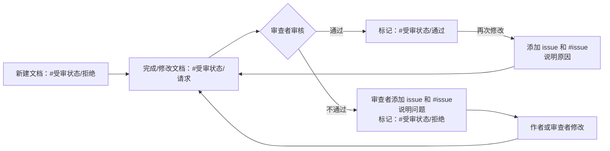

---
tags:
  - 规范
  - 受审状态/请求
updated: 2026-09-06
---
# 笔记属性（Frontmatter）规范

## 一、通用属性

| 属性名       | 类型                | 是否必需 | 说明                     |
| :-------- | :---------------- | :--- | :--------------------- |
| `updated` | `日期 (YYYY-MM-DD)` | ✅ 是  | 记录笔记最后修改的日期。           |
| `tags`    | `列表 [string]`     | ✅ 是  | 用于分类和检索的标签，详见下方标签规范。   |
| `aliases` | `别名`              | 可选   | 笔记的别名，便于搜索和 Wiki 链接引用。 |

---

## 二、标签（tags）规范

### 1. 课程类型标签

| 标签 | 用途 |
| :--- | :--- |
| `#主线` | 主线课程笔记。 |
| `#分支` | 分支/支线课程笔记。 |
| `#练习` | 主线的练习文档（课堂练习、综合练习）。 |
| `#规范` | 整个课程的规范文档。 |

> 可以根据教程内容扩展此列表。

### 2. 知识类型标签

用于标注笔记内容属于哪个知识领域：

| 标签示例            | 说明                  |
| :-------------- | :------------------ |
| `#知识类型/cpp`     | C++ 语言特性、语法、标准库等。   |
| `#知识类型/底层`      | 操作系统、内存、编译、链接等底层原理。 |
| `#知识类型/工程实践`    | 开发环境配置、工具链、调试、构建等。  |
| `#知识类型/数据结构与算法` | 数据结构与算法相关内容。        |

> 可以根据教程内容扩展此列表。

### 3. 受审状态标签（必须）

用于内容审核流程管理：

| 标签         | 说明                      |
| :--------- | :---------------------- |
| `#受审状态/请求` | 文档需要审核，或审核不通过修改后重新请求审核。 |
| `#受审状态/通过` | 文档已审核通过。                |
| `#受审状态/拒绝` | 文档审核不通过，或作者不请求审核。       |

### 4. 问题标记标签

用于在正文标记 `issue` 属性中说明的有问题的文本。将 `#issue` 标记在有问题的文本附近。

---

## 三、特殊属性

| 属性名       | 类型            | 适用文档           | 说明                              |
| :-------- | :------------ | :------------- | :------------------------------ |
| `前置知识-最低` | `列表 [string]` | 分支课程           | 阅读本文**必须**掌握的前置知识点。（分支课程必须有此属性） |
| `前置知识-推荐` | `列表 [string]` | 分支课程           | 阅读本文**推荐**掌握的前置知识点。             |
| `issue`   | `列表 [string]` | 有问题或已通过但被修改的文档 | 说明修改原因；审核不通过时由审查者说明问题。          |

---

## 四、属性顺序

| 顺序  | 属性名       | 属性类型 | 是否必须       |
| --- | --------- | ---- | ---------- |
| 1   | `aliases` | 别名   | ❌          |
| 2   | `tags`    | 标签   | ✅          |
| 3   | `前置知识-最低` | 列表   | ✅（分支课程中必须） |
| 4   | `前置知识-推荐` | 列表   | ❌          |
| 5   | `updated` | 日期   | ✅          |
| 6   | `issue`   | 列表   | ❌（有问题时才需要） |

---

## 五、示例

### 示例 1：主线课程

```yaml
---
tags:
  - 主线
  - 知识类型/cpp
updated: 2026-09-06
---
```

### 示例 2：分支课程（含审核状态和前置知识）

```yaml
---
aliases:
  - 内存访问底层原理概述
tags:
  - 分支
  - 受审状态/请求
  - 知识类型/底层
前置知识-最低:
  - 计算机的存储
  - 内存五区模型
前置知识-推荐:
  - 动态内存
  - 指针
updated: 2026-09-05
---
```

### 示例 3：审核通过后被修改（需添加 issue）

```yaml
---
tags:
  - 分支
  - 受审状态/请求      # 从“通过”改为“请求”
  - 知识类型/底层
updated: 2026-09-06
issue:
  - 修正了关于 TLB 刷新机制的描述错误
---
```

### 示例 4：审核不通过（审查者添加 issue）

```yaml
---
tags:
  - 分支
  - 受审状态/请求      # 修改后重新请求审核
  - 知识类型/底层
updated: 2026-09-06
issue:
  - 第 3.2 节中关于缓存一致性的描述有误，已修正
---
```

### 示例 5：正文中的 `#issue` 标记

审核者在审核不通过时，除了在 frontmatter 的 `issue` 属性中说明问题外，还应在正文中**有问题的文本附近**用 `#issue` 标签进行标记，方便作者快速定位。


**审查者收到一篇请求审核的笔记：**

```yaml
---
tags:
  - 分支
  - 受审状态/请求
  - 知识类型/底层
updated: 2026-09-06
---
```

**正文中存在两处问题：**

```markdown
#issue
当发生上下文切换（写入 CR3）时，TLB 中当前进程的所有条目会被标记为失效。
#issue
对于 32 位系统，一张完整的单级页表大小为 4 MB。
```

**审查者修改后的完整 frontmatter：**

```yaml
---
tags:
  - 分支
  - 受审状态/请求
  - 知识类型/底层
updated: 2026-09-06
issue:
  - 第 2.3 节中 TLB 刷新机制描述有误（全局页不会被冲刷）
  - 第 1.1 节中页表开销计算未考虑大页（Huge Page）情况
---
```

---

## 六、审核工作流


