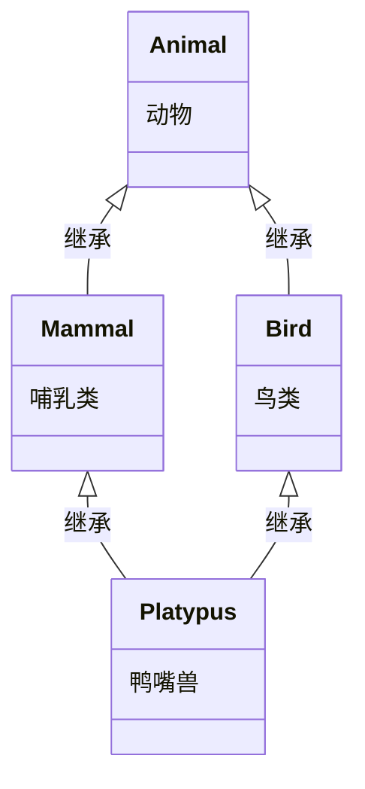

# 类的多态、virtual、override、final、菱形继承

---

## 1. 多态的基本概念

回到继承的例子：

```cpp
// 干员类
class Operator {
public:
    void Attack() { /* 基类默认实现 */ }
};

// 近卫干员
class Guard : public Operator {
public:
    void Attack() { /* 近卫：近战攻击 */ }
};

// 狙击干员
class Sniper : public Operator {
public:
    void Attack() { /* 狙击：远程射击 */ }
};
```

假设你有一个战斗系统，需要存储多个干员，并统一调用他们的 `Attack()`，你准备这么写吗？

```cpp
void Battle(Guard* guard) { guard->Attack(); }
void Battle(Sniper* sniper) { sniper->Attack() }
```

虽然这样写确实能工作，但是如果未来职业变多，战斗逻辑也变得更加复杂，这会导致**代码冗长**，还很**容易出错**。这时，我们就需要**多态**，让我们可以只传入 `Operator*` 类型，却能**根据情况调用不同职业的 `Attack` 函数**。

**多态**（Polymorphism）是面向对象编程的**第三大特性**（继封装、继承之后），它的核心含义是：“**同一个接口，多种不同的实现**。”

多态的分类：

| 类型        | 名称                         | 实现方式               | 绑定时机 |
| --------- | -------------------------- | ------------------ | ---- |
| **编译时多态** | 静态多态（Static Polymorphism）  | 函数重载、模板            | 编译期  |
| **运行时多态** | 动态多态（Dynamic Polymorphism） | 虚函数（`virtual`）+ 继承 | 运行期  |

**静态多态**我们已经接触过一些了——比如函数重载（同名函数，参数不同），编译器在编译时就能决定调用哪个版本。**动态多态**是本节的重点，它依赖于 `virtual` 关键字和继承机制。

---

## 2. 多态的实现

### 2.1 基础实现

要实现多态，概括来说需要：

| 要素                 | 说明                       |
| ------------------ | ------------------------ |
| **继承**             | 派生类继承基类                  |
| **虚函数（`virtual`）** | 基类中将要被重写的函数标记为 `virtual` |
| **基类指针 / 引用**      | 通过基类指针或引用指向派生类对象，调用虚函数   |

具体来说，步骤为：

1. 实现继承：

```cpp
// 干员类
class Operator {
public:
    void Attack() { std::cout << "干员攻击;\n"; }
};

// 近卫干员
class Guard : public Operator {
public:
    void Attack() { std::cout << "近卫干员挥砍;\n"; }
};

// 狙击干员
class Sniper : public Operator {
public:
    void Attack() { std::cout << "狙击干员开火;\n"; }
};
```

2. 在基类中将析构函数和要实现多态的成员函数声明为 `virtual`：

```cpp
// 干员类
class Operator {
public:
    virtual void Attack() { std::cout << "干员攻击;\n"; }
    virtual ~Operator() = default;
};
```

3. 在派生类中将要实现多态的成员函数声明为 `override`：

```cpp
// 近卫干员
class Guard : public Operator {
public:
    void Attack() override { std::cout << "近卫干员挥砍;\n"; }
};

// 狙击干员
class Sniper : public Operator {
public:
    void Attack() override { std::cout << "狙击干员开火;\n"; }
};
```

4. 通过基类指针或引用调用：

```cpp
void Test() {
	Guard g;
	Operator& op1 = g;
	Operator* op2 = new Sniper();
	
	op1.Attack();  // 输出：近卫干员挥砍
	op2->Attack(); // 输出：狙击干员开火
	
	delete op2;
}
```

### 2.2  virtual 说明符

#### 2.2.1 virtual 的基本概念

`virtual` 是**虚函数说明符（virtual function specifier）**,用于声明**虚函数（virtual function）**，它是 C++ 实现运行时多态的核心机制。

`virtual` 告诉编译器：**这个函数可能在派生类中被重写，调用时请根据对象的实际类型动态绑定，而不是只看指针或引用的静态类型（即原本的类型）。**

> [!NOTE] **概念**：静态类型和动态类型
> 1. **静态类型 (static type)** ：编译阶段、不运行程序就可以确定下来的类型。也就是表达式声明出来的类型。静态类型在编译期固定，运行时永远不会改变。
> 2. **动态类型 (dynamic type)**： 当表达式指向一个多态对象（含有虚函数的对象）时，**运行时实际所指对象的真实类型**。 只有使用引用 / 指针时才有可能出现静态类型 ≠ 动态类型的情况。
>    
>例如：
>
> ```cpp
> struct Base { virtual void f(){} };
> struct Derived : Base { };
> 
> Derived d;
> Base& r = d;
> ```
> 
> - `r` 的**静态类型**：`Base`
> - `r` 的**动态类型**：`Derived`
> 
> 如果不存在多态，那么**静态类型 = 动态类型**。

`virtual` 说明成员函数时将 `virtual` 写在返回类型前：

```cpp
virtual 返回类型 函数名(参数列表) { 函数体 }
```

#### 2.2.2 virtual 的说明范围

`virtual` **只能说明类的非静态成员函数**，不能用于：

- 普通全局函数
- 静态成员函数（`static`）
- 构造函数（不能是虚函数）

#### 2.2.3 virtual 的传递性

`virtual` 在继承层次中的 **传递性**：

一旦基类中的函数被声明为 `virtual`，它在所有派生类中**自动保持虚函数特性**，无论派生类是否显式写 `virtual`。

```cpp
class A {
public:
    virtual void Func() { std::cout << "A\n"; }
    virtual ~A() = default;
};

class B : public A {
public:
	// 这里的 Func 也是虚函数
    void Func() override { std::cout << "B\n"; }
	~B() = default;
};

class C : public B {
public:
	// 这里的 Func 仍然是虚函数
    void Func() override { std::cout << "C\n"; }
};
```

#### 2.2.4 virtual 与析构函数

析构函数可以是 `virtual`，而且**当类被设计为基类时，析构函数应该是 `virtual` **。

```cpp
class Base {
public:
    virtual ~Base() = default;
};
```

如果不这样做，通过基类指针删除派生类对象时，派生类的析构函数不会被调用，导致资源泄漏。

**原因**：`delete` 操作也是通过虚函数机制调用的。如果基类析构函数不是 `virtual`，`delete` 只会调用基类的析构函数，而不会触发派生类的析构。

即使类的析构函数体为空，也要加上 `virtual`。这是为了确保整个析构链能够正确执行。

因此：==**凡是设计为被继承的类（即作为基类使用），其析构函数应该声明为 `virtual`。即使析构函数体为空，也要加 `virtual`。**==

#### 2.2.5 virtual 与默认参数

**陷阱**：虚函数的默认实参是在**编译期**根据指针的静态类型确定的，而不是根据对象的动态类型。

```cpp
class A {
public:
    virtual void Print(int x = 10) {
        std::cout << "A: " << x << "\n";
    }
	virtual ~A() = default;
};
class B : public A {
public:
    void Print(int x = 20) override {
        std::cout << "B: " << x << "\n";
    }
};
int main() {
    A* p = new B();
    p->Print();   // 输出：B: 10 （不是 B: 20！）
    return 0;
}
```

**原因**：

- 函数地址：动态绑定 → 调用 `B::Print`
- 默认参数：静态绑定 → 使用 `A` 的默认实参 `10`

因此：==**不要给虚函数指定默认实参**==，除非你非常清楚这个陷阱。

### 2.3 override 说明符

#### 2.3.1 override 的基本概念

`override` 是 C++11 引入的一个**虚说明符 (virt-specifier)**，它的作用是**显式地告诉编译器：“这个函数打算重写基类中的虚函数。”**

| 作用        | 说明                                 |
| --------- | ---------------------------------- |
| **明确意图**  | 告诉代码阅读者：这个函数是在重写基类的虚函数             |
| **编译器检查** | 让编译器检查：基类中是否存在一个可被重写的虚函数（签名必须完全匹配） |
| **防止错误**  | 如果基类中没有对应的虚函数，或参数/const 不匹配，编译器报错  |

（也就是说重写函数时可以不写 `override`，但不推荐这样做）

`override` 说明成员函数时将 `override` 写在参数列表后：

```cpp
返回类型 函数名(参数列表) override { 函数体 }
```

#### 2.3.2 为什么要 override？

**没有 `override` 时，你可能写错而编译器不报错**：

```cpp
class A {
public:
    virtual void Func(int x) {}
	virtual ~A() = default;
};
class B : public A {
public:
    void Func(double x) {}   // 本想重写 A::Func，但不小心写成了 double
};
int main() {
    A* p = new B();
    p->Func(10);   // 期望调用 B::Func，实际调用 A::Func
    delete p;
    return 0;
}
```

以上代码**可以编译通过**，但行为不符合预期：

- `B::Func(double)` 是一个**新函数**，与 `A::Func(int)` **不是**重写关系（参数类型不同）。
- 通过基类指针调用时，调用的是 `A::Func(int)`，不是 `B::Func(double)`。
- 编译器不会给出任何警告——它认为这是合法的“名字隐藏”。    

**加上 `override` 后**：

```cpp
class B : public A {
public:
    void Func(double x) override {   // ❌ 编译错误！
        // 错误：使用“override”声明的成员函数不能重写基类成员
    }
};
```

编译器直接报错，提醒你 `Func(double)` 没有重写任何基类虚函数。你立刻就能发现自己写错了参数类型。

#### 2.3.3 重写条件

**重写条件**（必须全部满足，才算成功重写）：

| 条件               | 说明                             |
| ---------------- | ------------------------------ |
| **函数名**          | 必须相同                           |
| **参数列表**         | 必须相同（类型、个数、顺序）                 |
| **返回类型**         | 必须相同或为**协变返回类型**               |
| **const 限定符**    | 必须相同                           |
| **引用限定符**（C++11） | 如果基类有 `&` 或 `&&`，也必须相同（这里仅作了解） |

> [!NOTE] **概念**：协变返回类型 Covariant Return Type
> **协变返回类型**允许**派生类中重写的虚函数**，其返回类型**可以不同于基类**，但必须是基类返回类型的**派生类**（即更具体的子类型）。返回类型要作为协变返回类型，必须满足以下三个条件：
> 
> 1. 返回值都为**类的指针 / 左值引用 / 右值引用**；不能是普通值对象、二级指针。
> 2. 派生类某函数重写基类虚函数时，该派生类函数返回类型是基类虚函数返回类型的派生类。
> 3. 两个返回值的 cv 限定符（即 `const`, `volatile`）匹配，派生类函数返回类型的限定不能比基类的更严格。
> 
> 例如：
> 
> ```cpp
> class Base {};
> class Derived : public Base {};
> 
> class A {
> 	virtual const Base* Func() { ... } // 返回 const 限定
> 	virtual ~A() = default;
> };
> 
> class B : public A {
> 	Derived* Func() override { ... } // 返回无限定，更宽松
> };
> ```
> 
> 1. `A::Func()` 和 `B::Func` 返回的都是类的指针。
> 2. 派生类 `B` 的函数 `B::Func` 的返回类型 `Derived*` 是基类 `A` 的虚函数 `A::Func` 的返回类型 `const Base*` 的（隐式转换的）派生类。（这里发生的隐式转换是 `Derived*` → `Base*` → `const Base*` ）
> 3. `B::Func` 的返回值的限定（无 `const` ）比 `A::Func` 的返回值的限定（有 `const`）更宽松。

> [!TIP] **提示**：区分“隐藏”“重载”“重写”
> |对比维度|**隐藏 (Hide)**|**重载 (Overload)**|**重写 (Override)**|
> |---|---|---|---|
> |**发生在什么之间**|**基类 ↔ 派生类**（跨作用域）|**同一个作用域内**（通常是同一个类）|**基类 ↔ 派生类**（跨作用域）|
> |**函数名**|相同|相同|相同|
> |**参数列表**|**可以不同**|**必须不同**|**必须相同**|
> |**`virtual` 要求**|❌ 不需要|❌ 不需要|✅ **基类必须有 `virtual`**|
> |**发生在编译期还是运行期**|编译期|编译期|运行期（动态绑定）|
> |**典型用途**|派生类想“屏蔽”基类的同名成员|同一个类提供多种相似接口|实现多态，让同一接口表现不同行为|
> |**推荐程度**|⚠️ 谨慎使用（容易引起歧义）|✅ 常用|✅ **推荐**（结合 `override`）|
> |**回顾**| [[18. 类的继承、访问说明符、final#7. 继承中的名字隐藏\|18-7. 继承中的名字隐藏]] | [[8. 函数、return、参数、函数签名#3. 函数重载 Function Overloading\|8-3. 函数重载]] | [[#2. 多态的实现\|19-2. 多态的实现]] |

---

## 3. final 说明符

`final` 属于**虚说明符 (virt‑specifier)**，它有两种用途：

1. 修饰类时阻止该类被继承。  
2. 修饰虚函数时阻止派生类重写。

上一讲 [[18. 类的继承、访问说明符、final#5. final 说明符|18-5. final 说明符]] 中我们只学习了第一种用途，这一讲我们继续学习第二种用途。

第二种用途的作用：

|作用|说明|
|---|---|
|**明确设计意图**|告诉派生类：“这个函数到此为止，不能再被重写”|
|**防止意外重写**|如果有人试图在更深层的派生类中重写它，编译器报错|
|**编译器优化**|编译器知道该函数不会被进一步重写后，可以进行更积极的优化（如去虚拟化）|

要将某虚函数用 `final` 说明，需要将 `final` 写在参数列表后，例如：

```cpp
class Base {
public:
    virtual void Func() final;          // 声明为 final
    virtual void Print() const final;   // const 函数也可以
    virtual ~Base() = default;
};

class Derived : public Base {
public:
    void Func() override;   // ❌ 错误！Base::Func 是 final，不能重写
};
```

---

完成：[[19. 课堂练习：绘图系统 —— 形状的继承]]

![[19. 课堂练习：绘图系统 —— 形状的继承]]

---

## 4. 抽象类和纯虚函数

你是否发现了这种问题：

```cpp
// 图形类
class Shape {
	// 计算面积
	virtual double CalcArea() { // 计算面积的逻辑 };
	virtual ~Shape() = default;
};

// 圆类
class Circle : public Shape {
	double r_; // 半径
	// 计算面积
	double CalcArea() override { return r_ * r_ * 3.14; }
};

// 矩形类
class Rect : public Shape {
	double len_;    // 长
	double height_; // 高
	// 计算面积
	double CalcArea() override { return len_ * height_; }
};
```

`Rect` 和 `Circle` 继承 `Shape` 是合理的，因为 `Rect` 和 `Circle` 是一个 `Shape`，并且 `Shape` 中定义成员函数 `CalcArea` 也是合理的——图形都有面积这个概念。

但是不合理的地方是，`Shape` 其自身作为一种抽象**概念**，是没有面积的，那么 `Shape::CalcArea()` 中又该写什么呢？答案是：让 `Shape::CalcArea()` 成为一种纯虚函数，不提供实现逻辑，并让 `Shape` 成为一种抽象类。

### 4.1 纯虚函数 Pure Virtual Function

**纯虚函数（pure virtual function）** 是在基类中**只声明而不实现**（或给出默认实现，但通常不这么做）的**虚函数**，它通过 `= 0` 语法标记：

```cpp
class Shape {
public:
    // 纯虚函数：没有函数体，以 = 0 结尾
    virtual double CalcArea() const = 0;
    
    virtual ~Shape() = default;
};
```

它告诉编译器：“这个函数在基类中没有有意义的默认实现，所有派生类**必须**提供自己的实现。”

### 4.2 抽象类（Abstract Class）

**抽象类**是指**含有至少一个纯虚函数**的类。

```cpp
class Shape {
private:
	static constexpr const char class_name[] = "Shape"; // 普通成员
public:
    virtual double CalcArea() const = 0; // 纯虚函数 → Shape 是抽象类
    void PrintArea() const { ... } // 普通成员
    virtual ~Shape() = default;
};
```

**特点**：

| 特点                | 说明                          |
| ----------------- | --------------------------- |
| **不能实例化**         | 不能创建抽象类的对象。`Shape s;` 会编译报错 |
| **只能作为基类**        | 抽象类存在的意义就是被继承               |
| **派生类必须实现所有纯虚函数** | 否则派生类也会成为抽象类                |
| **可以拥有普通成员**      | 抽象类可以有普通成员函数、数据成员、构造函数等     |

例如：

```cpp
// 抽象类
class Shape {
public:
    // 纯虚函数：派生类必须实现
    virtual double CalcArea() const = 0;

    // 普通成员函数（派生类可以直接复用）
    void PrintArea() const {
        std::cout << "Area: " << CalcArea() << std::endl;
    }

    virtual ~Shape() = default;
};

// 派生类必须实现 CalcArea
class Circle : public Shape {
private:
    double r_;
public:
    Circle(double r) : r_(r) {}
    double CalcArea() const override {
        return 3.14159 * r_ * r_;
    }
};

// 派生类 Rect 没有实现 CalcArea → Rect 也是抽象类
class Rect : public Shape {
private:
    double len_, height_;
public:
    Rect(double l, double h) : len_(l), height_(h) {}
};

int main() {
    // Shape s;          // ❌ 错误：不能实例化抽象类
    // Rect r(4.0, 6.0); // ❌ 错误：不能实例化抽象类

    Circle c(5.0);
    
    c.PrintArea();   // Area: 78.5398

    // 多态：基类指针（或引用）指向派生类对象
    Shape* shape = &c;
	std::cout << shape->CalcArea() << std::endl; // 调用 c.CalcArea()

    return 0;
}
```

> [!TIP] **提示**：纯虚函数和空实现的虚函数的对比
> 
> |对比|纯虚函数（`= 0`）|空实现的虚函数（`{ }`）|
|---|---|---|
|**类是否抽象**|是抽象类，不能实例化|不是抽象类，可以实例化|
|**派生类是否必须实现**|必须实现（否则派生类也是抽象类）|可选，因为基类有默认实现|
|**设计意图**|“我要求所有派生类提供自己的实现（重写）”|“我提供一个默认实现，派生类可以选择重写”|

---

## 5. 纯抽象类 Pure Abstract Class

**纯抽象类（pure abstract class）**，也叫**接口类（interface class）**，是指有且仅有**纯虚函数**、**静态成员函数、析构函数的类。也就是说，它的所有非静态成员函数（除了析构函数）都是纯虚函数，用于定义接口契约。

简单来说：纯抽象类只描述“**能做什么**”，不描述“有什么（数据成员）”和“怎么做”。（对比普通抽象类除了描述“能做什么”还描述“有什么”）

**特点**：

| 特点                | 说明                   |
| ----------------- | -------------------- |
| **不能实例化**         | 不能创建纯抽象类的对象，否则会编译报错  |
| **只能作为基类**        | 纯抽象类存在的意义就是被继承       |
| **派生类必须实现所有纯虚函数** | 否则派生类会成为抽象类          |
| **不可以拥有普通成员**     | 没有数据成员，且所有成员函数均为纯虚函数 |

例如：

```cpp
// 纯抽象类：只定义接口
// 可绘制接口
class Drawable {
public:
    virtual void Draw() const = 0;         // 绘制
    virtual void Rotate(double angle) = 0; // 旋转
    virtual ~Drawable() = default;
};

// 派生类必须实现所有纯虚函数
// Circle 实现 Drawable → 约定 Circle 有绘制能力
class Circle : public Drawable {
public:
    void Draw() const override {
        // 画圆的实现
    }
    void Rotate(double angle) override {
        // 旋转圆的实现
    }
};
```

> [!TIP] **提示**：纯抽象类和普通抽象类的对比
> |对比维度|纯抽象类|普通抽象类|
> |---|---|---|
> |**数据成员**|❌ 没有|✅ 可以有|
> |**已实现的成员函数**|❌ 没有（成员函数都是纯虚函数）|✅ 可以有|
> |**构造函数的必要性**|❌ 通常不需要（或设为 `protected`）|✅ 需要，用于初始化数据成员|
> |**设计目的**|定义 **接口**，约定能做什么|定义 **基类骨架**，描述能做什么之外也提供部分默认（通用）做法|

> [!QUESTION] **问题**：为什么需要纯抽象类（接口）？
> |目的|说明|
> |---|---|
> |**定义契约**|规定所有派生类必须实现的方法，保证行为的一致性|
> |**分离接口与实现**|使用者只需要知道“能干什么”，不需要知道“怎么干”|
> |**支持安全的多重继承**|一个类可以继承多个纯抽象类，而不会引入数据成员冲突和菱形继承问题|
> 
> 关于纯抽象类的更多应用我们将在下一讲学到。

---

## 6. 菱形继承 Diamond Inheritance

### 6.1 菱形继承的基本概念

**菱形继承（diamond inheritance）**是多重继承中一种特殊的继承结构，因继承关系图看起来像菱形而得名。



形成菱形的条件是：

1. `Mammal` 和 `Bird` 都继承自同一个基类 `Animal`。
2. `Platypus` 同时继承 `Mammal` 和 `Bird`。

### 6.2 菱形继承带来的问题

1. **数据冗余**：

`Platypus` 对象中会包含**两份** `Animal` 的子对象（一份来自 `Mammal`，一份来自 `Bird`），造成内存浪费。

```cpp
class Animal { public: int age_; };
class Mammal : public Animal {};
class Bird : public Animal {};
class Platypus : public Mammal, public Bird {};

int main() {
    Platypus p;
    // p.age_ = 5;        // ❌ 二义性错误：哪个 age_？
    p.Mammal::age_ = 5;   // 访问 Mammal 中的 Animal::age_
    p.Bird::age_ = 3;     // 访问 Bird 中的 Animal::age_
    return 0;
}
```

2. **二义性**：

当通过 `Platypus` 对象访问 `Animal` 的成员时，编译器不知道应该使用 `Mammal` 继承来的那一份，还是 `Bird` 继承来的那一份。

3. **构造顺序混乱**：

`Animal` 的构造函数会被调用两次（一次通过 `Mammal`，一次通过 `Bird`），这可能不符合预期。

### 6.3 虚继承 Virtual Inheritance

C++ 提供了 **虚继承（virtual inheritance）** 来解决菱形继承问题。

在继承列表中加上 `virtual` 关键字 以使用虚继承，被虚继承的类叫做**虚基类**：

```cpp
class Mammal : virtual public Animal {}; // Animal 是 Mammal 的虚基类
class Bird : virtual public Animal {};   // Animal 是 Bird 的虚基类
```

虚继承的**效果**：

| 效果 | 说明 |
| :--- | :--- |
| **共享基类子对象** | `Mammal` 和 `Bird` 共享同一个 `Animal` 子对象，而不是各有一份 |
| **消除二义性** | 通过 `Platypus` 访问 `Animal` 成员不再有歧义 |
| **构造顺序确定** | `Animal` 只构造一次，且由最底层的派生类直接负责 |

```cpp
class Animal { public: int age_; };
class Mammal : virtual public Animal {};
class Bird : virtual public Animal {};
class Platypus : public Mammal, public Bird {};

int main() {
    Platypus p;
    p.age_ = 5; // 现在只有一个 Animal 子对象，没有二义性
    return 0;
}
```

当使用虚继承时，构造顺序变为：

1. **最顶层的虚基类**（`Animal`）先构造。
2. **按最底层的派生类的派生列表中声明的顺序构造非虚基类**（即 `Mammal`、`Bird`）。
3. **最后构造最底层派生类自己**（`Platypus`）。

> **提示**：虚基类由**最底层的派生类**负责构造，而不是由中间类。

> **提示**：“最底层派生类”是指发生菱形继承的派生类，即继承了多个类的类，这里指的是 `Platypus` 。

```cpp
class Animal {
public:
    Animal() { std::cout << "Animal\n"; }
};

class Mammal : virtual public Animal {
public:
    Mammal() { std::cout << "Mammal\n"; }
};

class Bird : virtual public Animal {
public:
    Bird() { std::cout << "Bird\n"; }
};

class Platypus : public Mammal, public Bird {
public:
    Platypus() { std::cout << "Platypus\n"; }
};

int main() {
    Platypus p;
    return 0;
}
```

输出（只构造一次 `Animal`）：

```text
Animal
Mammal
Bird
Platypus
```

> [!WARNING] **注意**：虚继承的性能开销
> 虚继承虽然解决了菱形继承问题，但也会带来一些代价：
> 
> |开销|说明|
> |---|---|
> |**内存开销**|虚基类需要额外的指针/偏移量来定位共享子对象|
> |**访问开销**|访问虚基类成员比普通成员稍慢（需要间接寻址）|
> |**对象布局复杂**|对象的内存布局比普通继承更复杂|
> |**构造/析构复杂**|最底层派生类必须直接初始化虚基类，可能导致构造顺序不易理解|
> 
> 因此，**虚继承只在确实需要解决菱形继承时才使用**，不应滥用。

